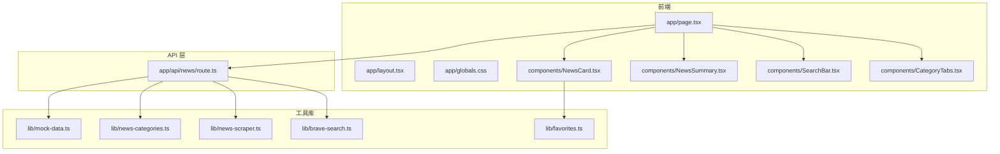
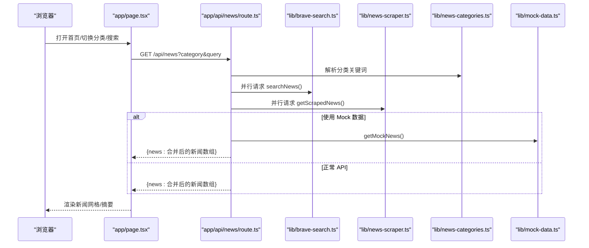
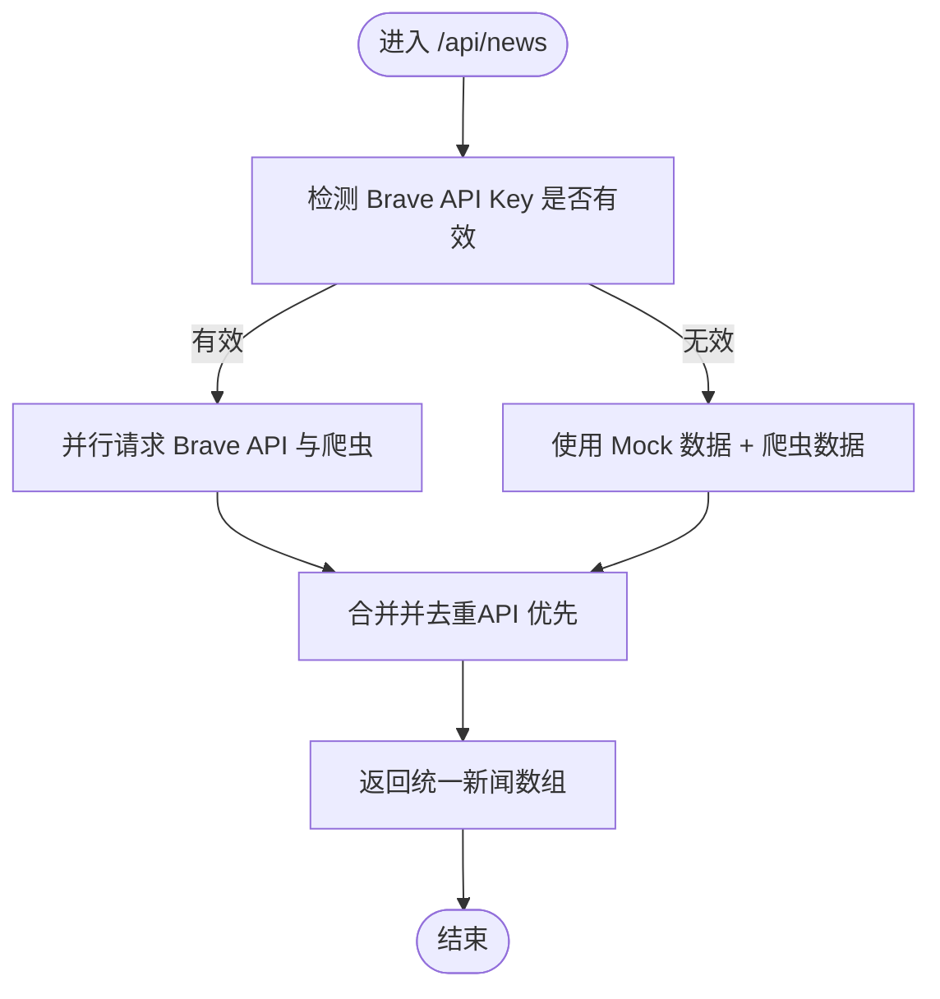
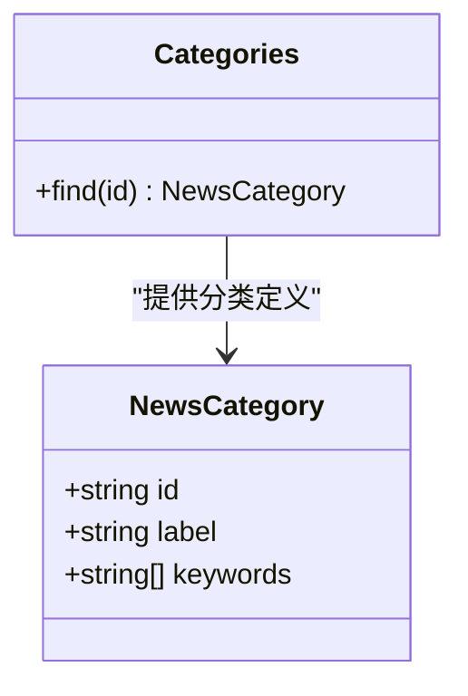
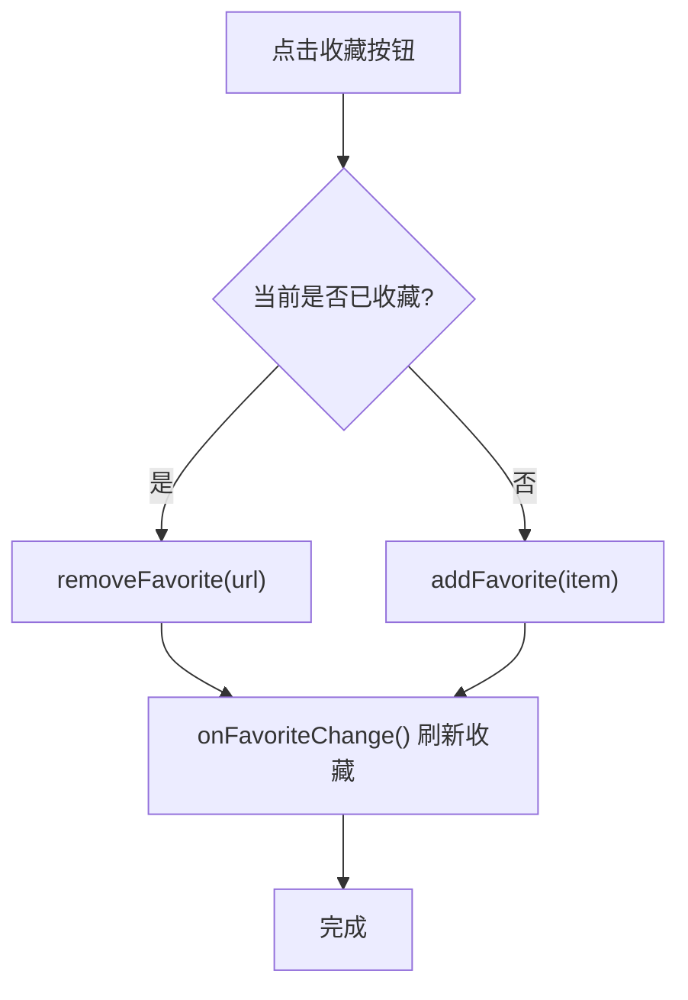
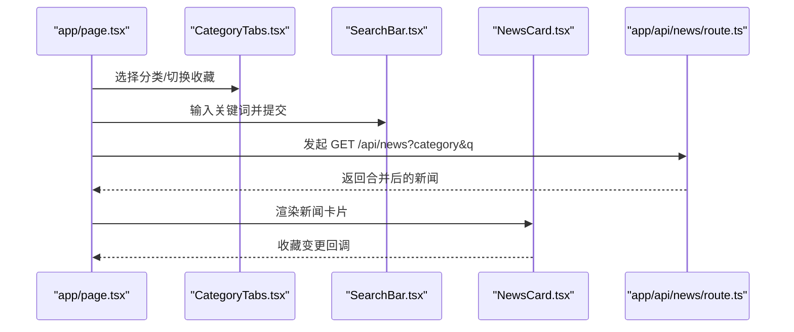
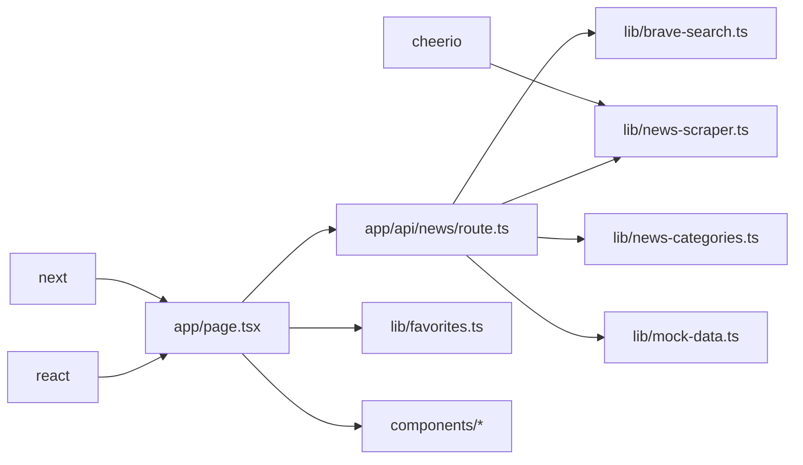

# 核心功能模块

<cite>
**本文引用的文件**
- [README.md](file://README.md)
- [package.json](file://package.json)
- [app/layout.tsx](file://app/layout.tsx)
- [app/page.tsx](file://app/page.tsx)
- [app/api/news/route.ts](file://app/api/news/route.ts)
- [lib/brave-search.ts](file://lib/brave-search.ts)
- [lib/news-scraper.ts](file://lib/news-scraper.ts)
- [lib/news-categories.ts](file://lib/news-categories.ts)
- [lib/favorites.ts](file://lib/favorites.ts)
- [lib/mock-data.ts](file://lib/mock-data.ts)
- [components/CategoryTabs.tsx](file://components/CategoryTabs.tsx)
- [components/NewsCard.tsx](file://components/NewsCard.tsx)
- [components/NewsSummary.tsx](file://components/NewsSummary.tsx)
- [components/SearchBar.tsx](file://components/SearchBar.tsx)
- [app/globals.css](file://app/globals.css)
</cite>

## 目录
1. [简介](#简介)
2. [项目结构](#项目结构)
3. [核心组件](#核心组件)
4. [架构总览](#架构总览)
5. [详细组件分析](#详细组件分析)
6. [依赖分析](#依赖分析)
7. [性能考量](#性能考量)
8. [故障排查指南](#故障排查指南)
9. [结论](#结论)
10. [附录](#附录)

## 简介
本项目是一个基于 Next.js 的新闻网站，提供分类浏览、今日摘要、关键词搜索以及收藏管理等核心功能。系统通过 Brave Search API 获取权威新闻数据，并结合自定义爬虫抓取补充内容；同时提供 Mock 数据回退方案，确保在未配置 API 密钥或 API 失败时仍能正常运行。前端采用组件化设计，配合本地收藏持久化，为用户提供一致且高性能的阅读体验。

## 项目结构
项目采用 Next.js 应用程序目录结构，核心模块分布如下：
- 前端页面与布局：app/page.tsx、app/layout.tsx、app/globals.css
- API 路由：app/api/news/route.ts
- 工具库与业务逻辑：lib/brave-search.ts、lib/news-scraper.ts、lib/news-categories.ts、lib/favorites.ts、lib/mock-data.ts
- UI 组件：components/CategoryTabs.tsx、components/NewsCard.tsx、components/NewsSummary.tsx、components/SearchBar.tsx
- 依赖与环境：package.json、README.md

图表来源
- [app/page.tsx](file://app/page.tsx#L1-L153)
- [app/api/news/route.ts](file://app/api/news/route.ts#L1-L136)
- [lib/brave-search.ts](file://lib/brave-search.ts#L1-L115)
- [lib/news-scraper.ts](file://lib/news-scraper.ts#L1-L166)
- [lib/news-categories.ts](file://lib/news-categories.ts#L1-L45)
- [lib/favorites.ts](file://lib/favorites.ts#L1-L29)
- [lib/mock-data.ts](file://lib/mock-data.ts#L1-L197)
- [components/CategoryTabs.tsx](file://components/CategoryTabs.tsx#L1-L49)
- [components/NewsCard.tsx](file://components/NewsCard.tsx#L1-L89)
- [components/NewsSummary.tsx](file://components/NewsSummary.tsx#L1-L54)
- [components/SearchBar.tsx](file://components/SearchBar.tsx#L1-L37)
- [app/layout.tsx](file://app/layout.tsx#L1-L20)
- [app/globals.css](file://app/globals.css#L1-L22)

章节来源
- [README.md](file://README.md#L36-L48)
- [package.json](file://package.json#L1-L30)

## 核心组件
- 新闻数据获取系统
  - Brave Search API 集成：负责从 Brave Search 获取新闻结果，支持按分类关键词检索与回退到网页搜索。
  - 自定义爬虫：针对特定站点（如 Hacker News）进行定向抓取，补充科技、商业、国际时政等分类内容。
  - 合并与去重：将 API 与爬虫结果合并，优先保留 API 条目并去除标题重复项。
- 新闻分类系统
  - 分类定义与关键词映射：提供“综合热点”“国际时政”“财经商业”“科技互联网”等分类及其关键词集合。
  - 分类选择与查询构造：根据分类生成查询关键词串，或直接使用用户输入关键词。
- 收藏管理系统
  - 本地存储：基于浏览器 localStorage 实现收藏增删查与持久化。
  - UI 卡片交互：新闻卡片支持收藏/取消收藏，收藏状态变更后触发刷新。

章节来源
- [lib/brave-search.ts](file://lib/brave-search.ts#L1-L115)
- [lib/news-scraper.ts](file://lib/news-scraper.ts#L1-L166)
- [app/api/news/route.ts](file://app/api/news/route.ts#L13-L37)
- [lib/news-categories.ts](file://lib/news-categories.ts#L1-L45)
- [lib/favorites.ts](file://lib/favorites.ts#L1-L29)
- [components/NewsCard.tsx](file://components/NewsCard.tsx#L1-L89)

## 架构总览
系统采用前后端分离的 API 路由模式：前端页面通过 fetch 请求 /api/news，后端路由并行拉取 Brave API 与爬虫数据，完成合并与去重后返回统一格式的新闻列表。若 API 不可用，则回退到 Mock 数据与爬虫数据的组合，保证服务连续性。

图表来源
- [app/page.tsx](file://app/page.tsx#L19-L63)
- [app/api/news/route.ts](file://app/api/news/route.ts#L39-L134)
- [lib/brave-search.ts](file://lib/brave-search.ts#L30-L73)
- [lib/news-scraper.ts](file://lib/news-scraper.ts#L140-L153)
- [lib/news-categories.ts](file://lib/news-categories.ts#L42-L44)
- [lib/mock-data.ts](file://lib/mock-data.ts#L194-L196)

## 详细组件分析

### 新闻数据获取系统（Brave Search API 与自定义爬虫）
- 设计要点
  - 并行获取：API 路由同时发起 Brave API 与爬虫请求，缩短整体等待时间。
  - 回退策略：当 API Key 未配置或 API 调用失败时，自动回退到 Mock 数据与爬虫数据的合并。
  - 合并与去重：以标题标准化为键进行去重，优先保留 API 来源条目，提升权威性。
- 错误处理
  - API 失败时捕获异常并回退到 Mock + 爬虫，保证前端稳定输出。
  - 爬虫异常被局部捕获，不影响其他分类的抓取与合并。
- 性能优化
  - 并发请求减少总延迟。
  - 爬虫限制每分类抓取数量，避免过度请求与渲染压力。
  - 使用新鲜度参数与英文语言过滤，提高结果质量与稳定性。

图表来源
- [app/api/news/route.ts](file://app/api/news/route.ts#L7-L134)
- [lib/brave-search.ts](file://lib/brave-search.ts#L30-L73)
- [lib/news-scraper.ts](file://lib/news-scraper.ts#L140-L153)
- [lib/mock-data.ts](file://lib/mock-data.ts#L194-L196)

章节来源
- [app/api/news/route.ts](file://app/api/news/route.ts#L39-L134)
- [lib/brave-search.ts](file://lib/brave-search.ts#L30-L115)
- [lib/news-scraper.ts](file://lib/news-scraper.ts#L116-L153)
- [lib/mock-data.ts](file://lib/mock-data.ts#L1-L197)

### 新闻分类系统
- 设计要点
  - 分类枚举与关键词映射：为每个分类提供一组关键词，用于 Brave API 查询。
  - 分类解析：根据分类 ID 获取对应关键词集合，构造查询串。
- 使用模式
  - 无查询词：使用分类关键词串（OR 连接）。
  - 有查询词：直接使用用户输入。
- 可扩展性
  - 新增分类只需在分类表中添加条目，无需修改 API 路由逻辑。

图表来源
- [lib/news-categories.ts](file://lib/news-categories.ts#L1-L45)

章节来源
- [lib/news-categories.ts](file://lib/news-categories.ts#L7-L44)
- [app/api/news/route.ts](file://app/api/news/route.ts#L76-L90)

### 收藏管理系统
- 设计要点
  - 本地存储：使用 localStorage 存储收藏数组，键名固定。
  - 去重策略：按 URL 判断是否已收藏，避免重复。
  - 即时反馈：卡片点击收藏/取消收藏后立即更新状态并回调刷新。
- 错误处理
  - 在服务端或非浏览器环境下（如 SSR）读取收藏时返回空数组，避免异常。
- 使用模式
  - 页面切换到“我的收藏”时，从本地读取并渲染。
  - 收藏变更后触发刷新，保持 UI 与存储同步。

图表来源
- [components/NewsCard.tsx](file://components/NewsCard.tsx#L19-L27)
- [lib/favorites.ts](file://lib/favorites.ts#L13-L24)

章节来源
- [lib/favorites.ts](file://lib/favorites.ts#L1-L29)
- [components/NewsCard.tsx](file://components/NewsCard.tsx#L1-L89)
- [app/page.tsx](file://app/page.tsx#L54-L63)

### 前端页面与组件
- 页面逻辑
  - 初始化状态：新闻列表、加载状态、分类、收藏状态、错误信息。
  - 数据获取：根据分类或搜索词调用 /api/news，处理响应与错误。
  - 视图渲染：加载态骨架屏、新闻网格、今日摘要、错误提示。
- 组件职责
  - CategoryTabs：分类标签与“我的收藏”切换。
  - SearchBar：关键词输入与提交。
  - NewsCard：新闻卡片展示与收藏交互。
  - NewsSummary：渲染当日前五条摘要。

图表来源
- [app/page.tsx](file://app/page.tsx#L19-L63)
- [components/CategoryTabs.tsx](file://components/CategoryTabs.tsx#L12-L46)
- [components/SearchBar.tsx](file://components/SearchBar.tsx#L9-L36)
- [components/NewsCard.tsx](file://components/NewsCard.tsx#L12-L27)
- [app/api/news/route.ts](file://app/api/news/route.ts#L39-L134)

章节来源
- [app/page.tsx](file://app/page.tsx#L1-L153)
- [components/CategoryTabs.tsx](file://components/CategoryTabs.tsx#L1-L49)
- [components/SearchBar.tsx](file://components/SearchBar.tsx#L1-L37)
- [components/NewsCard.tsx](file://components/NewsCard.tsx#L1-L89)
- [components/NewsSummary.tsx](file://components/NewsSummary.tsx#L1-L54)

## 依赖分析
- 外部依赖
  - next：框架核心，提供 App Router、SSR/CSR 能力。
  - react/react-dom：UI 渲染与组件生态。
  - cheerio：服务端 HTML 解析与 DOM 选择器。
- 内部模块耦合
  - API 路由依赖分类、Brave 搜索、爬虫与 Mock 数据模块。
  - 前端页面依赖 API 路由与收藏模块。
  - 组件依赖类型定义与收藏模块。

图表来源
- [package.json](file://package.json#L15-L28)
- [app/page.tsx](file://app/page.tsx#L1-L153)
- [app/api/news/route.ts](file://app/api/news/route.ts#L1-L136)
- [lib/news-scraper.ts](file://lib/news-scraper.ts#L1-L166)
- [lib/brave-search.ts](file://lib/brave-search.ts#L1-L115)
- [lib/news-categories.ts](file://lib/news-categories.ts#L1-L45)
- [lib/mock-data.ts](file://lib/mock-data.ts#L1-L197)
- [lib/favorites.ts](file://lib/favorites.ts#L1-L29)

章节来源
- [package.json](file://package.json#L15-L28)

## 性能考量
- 并发优化
  - API 路由中对 Brave API 与爬虫请求使用并发执行，减少总等待时间。
- 数据去重与裁剪
  - 合并时以标题标准化为键去重，避免重复渲染。
  - 爬虫默认限制每分类抓取数量，控制初始数据规模。
- 缓存与回退
  - Mock 数据作为快速回退路径，保障不可用场景下的可用性。
- 前端体验
  - 加载态骨架屏与摘要展示，改善感知性能。
  - 本地收藏即时更新，减少网络往返。

## 故障排查指南
- API Key 未配置或无效
  - 现象：返回 Mock 数据与爬虫数据的合并结果。
  - 处理：在环境变量中正确填写 Brave API Key。
- Brave Search API 调用失败
  - 现象：回退到 Mock + 爬虫数据，返回标记为 mock 的响应。
  - 处理：检查网络连通性与配额，或稍后重试。
- 爬虫抓取异常
  - 现象：对应分类的爬虫数据为空，但不影响其他分类。
  - 处理：检查目标站点可访问性与选择器有效性。
- 收藏无法保存
  - 现象：收藏状态不更新或刷新后丢失。
  - 处理：确认浏览器允许 localStorage，或检查服务端渲染环境中的读取逻辑。

章节来源
- [app/api/news/route.ts](file://app/api/news/route.ts#L7-L134)
- [lib/brave-search.ts](file://lib/brave-search.ts#L35-L58)
- [lib/news-scraper.ts](file://lib/news-scraper.ts#L132-L135)
- [lib/favorites.ts](file://lib/favorites.ts#L8-L11)

## 结论
本项目通过 API 与爬虫双通道获取新闻数据，结合分类关键词与 Mock 回退机制，实现了高可用、可扩展的新闻聚合系统。前端组件清晰分层，收藏管理本地化，整体具备良好的开发体验与用户体验。后续可在以下方向进一步完善：增强爬虫稳定性与规则引擎、引入缓存层减少重复请求、扩展更多新闻源与分类维度。

## 附录
- 快速启动与配置
  - 安装依赖并启动开发服务器。
  - 在本地环境文件中配置 Brave API Key。
  - 访问本地开发地址查看效果。
- 项目结构概览
  - 前端页面、组件与全局样式位于 app 与 components 目录。
  - 业务逻辑封装于 lib 目录，API 路由位于 app/api/news/route.ts。
  - 依赖与脚本定义于 package.json。

章节来源
- [README.md](file://README.md#L5-L32)
- [README.md](file://README.md#L36-L48)
- [package.json](file://package.json#L1-L30)