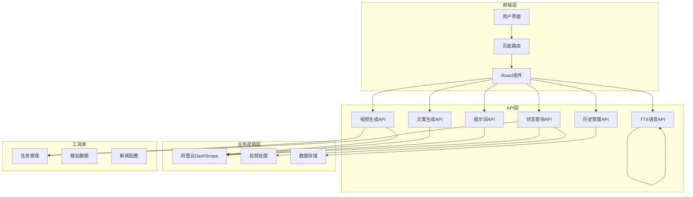
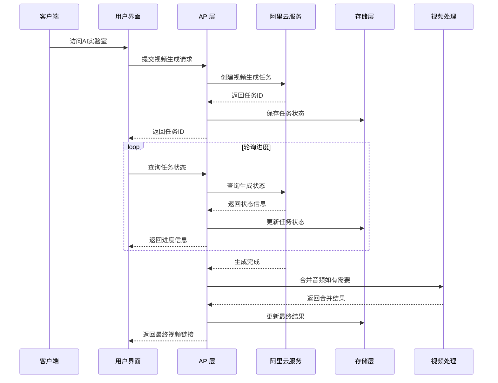
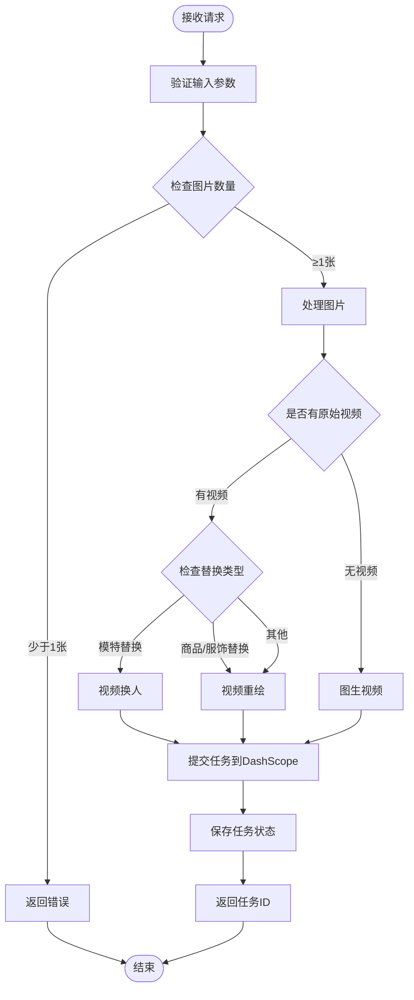
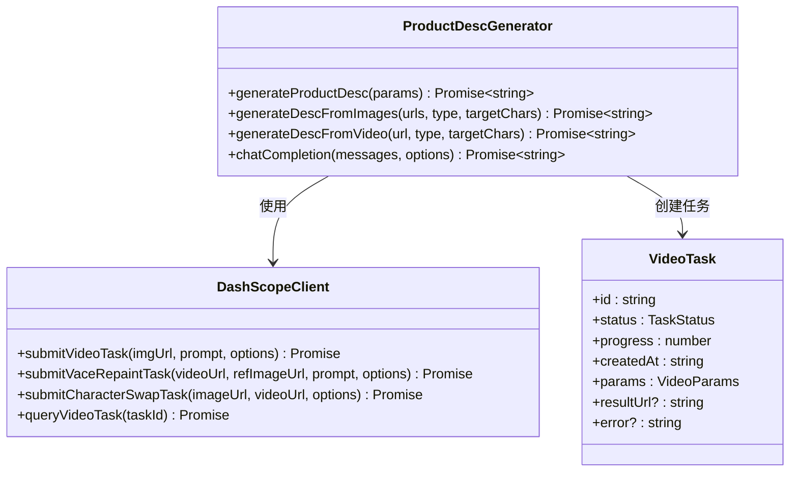
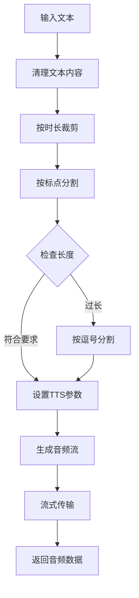
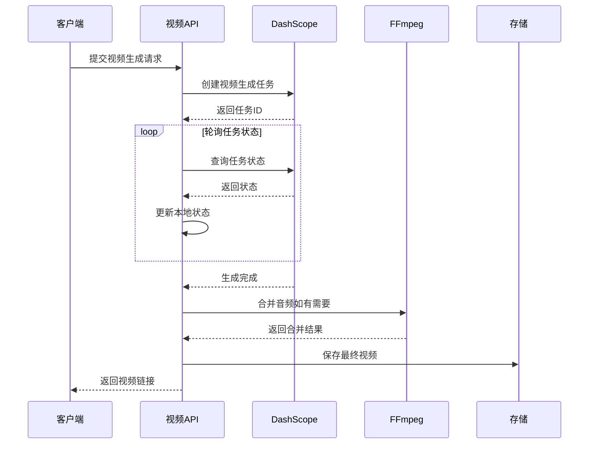
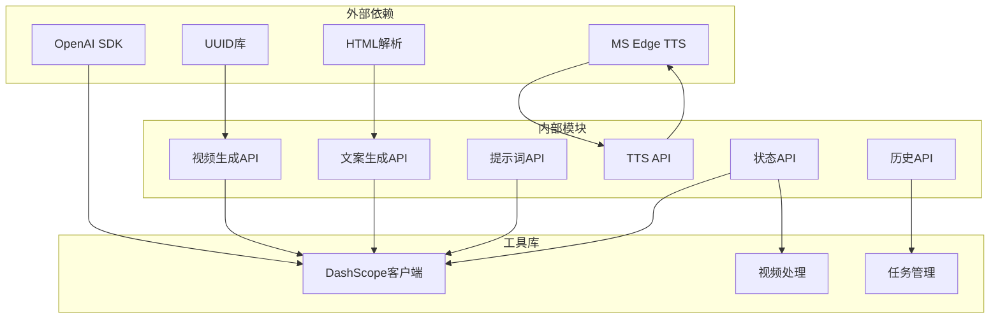

# 视频生成管道

<cite>
**本文档引用的文件**
- [README.md](file://README.md)
- [package.json](file://package.json)
- [app/api/ai-lab/generate-video/route.ts](file://app/api/ai-lab/generate-video/route.ts)
- [app/api/ai-lab/generate-desc/route.ts](file://app/api/ai-lab/generate-desc/route.ts)
- [app/api/ai-lab/generate-prompt/route.ts](file://app/api/ai-lab/generate-prompt/route.ts)
- [app/api/ai-lab/generate-tts/route.ts](file://app/api/ai-lab/generate-tts/route.ts)
- [app/api/ai-lab/generate-video/status/route.ts](file://app/api/ai-lab/generate-video/status/route.ts)
- [app/api/ai-lab/history/route.ts](file://app/api/ai-lab/history/route.ts)
- [lib/video-tasks.ts](file://lib/video-tasks.ts)
- [lib/ffmpeg-merge.ts](file://lib/ffmpeg-merge.ts)
- [lib/aliyun/dashscope.ts](file://lib/aliyun/dashscope.ts)
- [app/ai-lab/product-swap/page.tsx](file://app/ai-lab/product-swap/page.tsx)
- [app/ai-lab/page.tsx](file://app/ai-lab/page.tsx)
- [config/news-sources.json](file://config/news-sources.json)
- [lib/mock-data.ts](file://lib/mock-data.ts)
</cite>

## 目录
1. [简介](#简介)
2. [项目结构](#项目结构)
3. [核心组件](#核心组件)
4. [架构概览](#架构概览)
5. [详细组件分析](#详细组件分析)
6. [依赖关系分析](#依赖关系分析)
7. [性能考虑](#性能考虑)
8. [故障排除指南](#故障排除指南)
9. [结论](#结论)

## 简介

这是一个基于Next.js构建的AI视频生成管道系统，专注于电商内容创作。该系统提供了完整的视频生成工作流程，包括素材上传、AI生成、文案创作、配音合成和历史管理等功能。

系统的核心特色包括：
- 多种视频生成模式：商品替换、服饰替换、模特替换、图生视频
- 智能提示词生成和优化
- AI文案创作和本地化翻译
- 多语种TTS语音合成
- 高级视频处理和音频合并
- 完整的历史记录管理

## 项目结构

项目采用Next.js标准结构，主要分为以下几个部分：

**图表来源**
- [app/ai-lab/page.tsx:1-130](file://app/ai-lab/page.tsx#L1-130)
- [app/api/ai-lab/generate-video/route.ts:1-120](file://app/api/ai-lab/generate-video/route.ts#L1-120)
- [lib/aliyun/dashscope.ts:1-586](file://lib/aliyun/dashscope.ts#L1-586)

**章节来源**
- [README.md:36-49](file://README.md#L36-L49)
- [package.json:1-34](file://package.json#L1-L34)

## 核心组件

### 视频生成系统

系统提供四种主要的视频生成模式：

1. **商品替换模式** - 将参考图片中的商品替换到视频中
2. **服饰替换模式** - 将参考图片中的服饰替换到视频中，保持人体姿态
3. **模特替换模式** - 将参考图片中的模特替换到视频中
4. **图生视频模式** - 基于图片生成全新的视频内容

### AI智能助手

- **文案生成** - 基于图片内容生成电商推广文案
- **提示词优化** - 智能分析图片内容生成视频提示词
- **多语种翻译** - 支持中文到英文的营销文案本地化

### 高级处理功能

- **音频合并** - 将原始视频音频与AI生成视频合并
- **进度跟踪** - 实时监控视频生成进度
- **历史管理** - 保存和管理生成的视频记录

**章节来源**
- [app/ai-lab/product-swap/page.tsx:14-22](file://app/ai-lab/product-swap/page.tsx#L14-L22)
- [lib/aliyun/dashscope.ts:64-123](file://lib/aliyun/dashscope.ts#L64-L123)

## 架构概览

系统采用分层架构设计，确保各组件职责明确且易于维护：

**图表来源**
- [app/api/ai-lab/generate-video/route.ts:30-120](file://app/api/ai-lab/generate-video/route.ts#L30-L120)
- [app/api/ai-lab/generate-video/status/route.ts:17-114](file://app/api/ai-lab/generate-video/status/route.ts#L17-L114)
- [lib/ffmpeg-merge.ts:73-157](file://lib/ffmpeg-merge.ts#L73-L157)

## 详细组件分析

### 视频生成API

视频生成API是整个系统的核心，负责处理各种视频生成请求：

**图表来源**
- [app/api/ai-lab/generate-video/route.ts:30-120](file://app/api/ai-lab/generate-video/route.ts#L30-L120)

#### 核心功能特性

1. **多模式支持** - 支持四种不同的视频生成模式
2. **智能图片处理** - 自动处理本地图片和远程URL
3. **任务管理** - 完整的任务生命周期管理
4. **错误处理** - 全面的错误捕获和处理机制

**章节来源**
- [app/api/ai-lab/generate-video/route.ts:11-120](file://app/api/ai-lab/generate-video/route.ts#L11-L120)

### AI文案生成系统

AI文案生成系统提供智能化的电商推广文案创作：

**图表来源**
- [lib/aliyun/dashscope.ts:64-250](file://lib/aliyun/dashscope.ts#L64-L250)
- [lib/video-tasks.ts:6-39](file://lib/video-tasks.ts#L6-L39)

#### 文案生成策略

系统采用多层次的文案生成策略：

1. **图片优先** - 基于上传的商品图片内容分析
2. **视频分析** - 基于视频内容的深度分析
3. **AI生成** - 无素材时的通用文案生成
4. **时长适配** - 根据视频时长自动调整文案长度

**章节来源**
- [lib/aliyun/dashscope.ts:64-250](file://lib/aliyun/dashscope.ts#L64-L250)

### TTS语音合成系统

TTS语音合成系统提供高质量的语音生成服务：

**图表来源**
- [app/api/ai-lab/generate-tts/route.ts:10-93](file://app/api/ai-lab/generate-tts/route.ts#L10-L93)

#### 技术特点

1. **智能文本处理** - 自动清理特殊字符和表情符号
2. **时长精确控制** - 基于中文语速3.8字/秒的精确计算
3. **多级分割策略** - 句子、感叹号、问号、逗号的多级分割
4. **流式音频输出** - 支持边生成边播放的音频流

**章节来源**
- [app/api/ai-lab/generate-tts/route.ts:10-93](file://app/api/ai-lab/generate-tts/route.ts#L10-L93)

### 视频处理管道

视频处理管道负责复杂的视频生成和后处理任务：

**图表来源**
- [app/api/ai-lab/generate-video/status/route.ts:52-114](file://app/api/ai-lab/generate-video/status/route.ts#L52-L114)
- [lib/ffmpeg-merge.ts:73-157](file://lib/ffmpeg-merge.ts#L73-L157)

#### 处理流程

1. **异步任务管理** - 支持长时间运行的视频生成任务
2. **智能进度估算** - 基于轮询次数和任务状态估算进度
3. **音频合并优化** - 自动检测和合并原始视频音频
4. **错误恢复机制** - 处理各种异常情况并提供回退方案

**章节来源**
- [app/api/ai-lab/generate-video/status/route.ts:8-114](file://app/api/ai-lab/generate-video/status/route.ts#L8-L114)
- [lib/ffmpeg-merge.ts:73-157](file://lib/ffmpeg-merge.ts#L73-L157)

## 依赖关系分析

系统依赖关系清晰，各模块职责明确：

**图表来源**
- [package.json:15-32](file://package.json#L15-L32)
- [lib/aliyun/dashscope.ts:1-8](file://lib/aliyun/dashscope.ts#L1-L8)

### 核心依赖说明

1. **OpenAI SDK** - 用于DashScope API通信和AI模型调用
2. **UUID库** - 生成唯一任务ID
3. **MS Edge TTS** - 提供高质量的语音合成服务
4. **Cheerio** - 用于网页内容解析（新闻爬虫）

**章节来源**
- [package.json:15-32](file://package.json#L15-L32)

## 性能考虑

### 并发处理

系统采用异步架构设计，支持高并发请求处理：

- **非阻塞I/O** - 所有网络请求都使用异步方式处理
- **任务队列** - 使用内存Map存储任务状态，支持大量并发任务
- **流式处理** - 音频和视频数据采用流式传输，减少内存占用

### 缓存策略

- **任务状态缓存** - 内存中缓存最近的视频生成任务
- **图片预处理** - 支持Base64和URL两种图片格式，减少重复处理
- **配置缓存** - 环境变量和配置信息缓存，避免重复读取

### 资源管理

- **文件清理** - 自动清理临时文件和过期任务
- **连接池** - DashScope API连接复用，减少连接开销
- **超时控制** - 所有外部请求都有合理的超时设置

## 故障排除指南

### 常见问题及解决方案

#### 1. API密钥配置问题

**问题症状**：DashScope API调用失败，返回认证错误

**解决方法**：
- 确认`.env.local`文件中设置了`DASHSCOPE_API_KEY`
- 验证API密钥的有效性和权限
- 检查网络连接是否正常

#### 2. 视频生成失败

**问题症状**：任务状态显示失败，无法获取视频链接

**解决方法**：
- 检查输入的图片和视频格式是否正确
- 确认文件大小和分辨率符合要求
- 查看DashScope返回的具体错误信息

#### 3. 音频合并问题

**问题症状**：生成的视频缺少音频或音频不同步

**解决方法**：
- 确认原始视频包含音频轨道
- 检查FFmpeg安装是否正确
- 验证网络连接和文件下载权限

#### 4. TTS语音生成问题

**问题症状**：语音合成失败或音频质量差

**解决方法**：
- 检查文本内容是否包含特殊字符
- 确认时长参数设置合理
- 验证网络连接和音频格式

**章节来源**
- [app/api/ai-lab/generate-video/route.ts:112-118](file://app/api/ai-lab/generate-video/route.ts#L112-L118)
- [app/api/ai-lab/generate-tts/route.ts:85-91](file://app/api/ai-lab/generate-tts/route.ts#L85-L91)

## 结论

这个视频生成管道系统展现了现代AI应用的完整架构设计，具有以下优势：

1. **功能完整性** - 提供从素材准备到成品发布的完整工作流程
2. **技术先进性** - 集成了多种前沿AI技术和工具
3. **用户体验友好** - 直观的界面设计和流畅的操作体验
4. **可扩展性强** - 模块化设计便于功能扩展和维护

系统特别适用于电商内容创作、短视频制作和数字营销等应用场景。通过AI技术的应用，大大提高了视频内容生产的效率和质量，降低了创作门槛。

未来可以考虑的功能扩展包括：
- 更多的视频生成模型支持
- 实时协作功能
- 更丰富的模板和特效
- 多平台导出支持
- 高级编辑功能