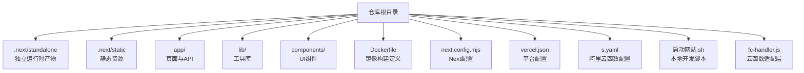
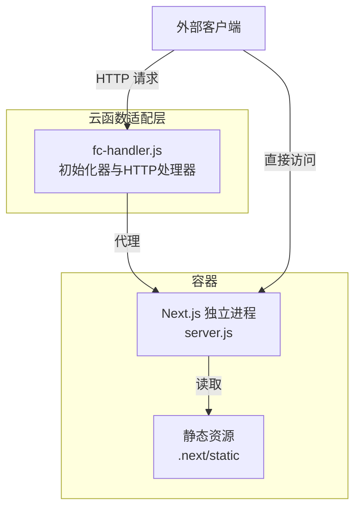
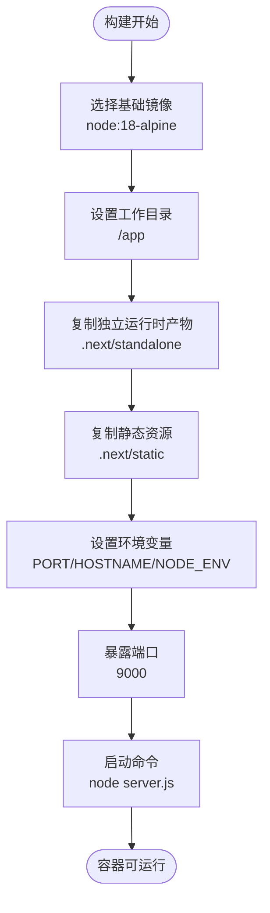
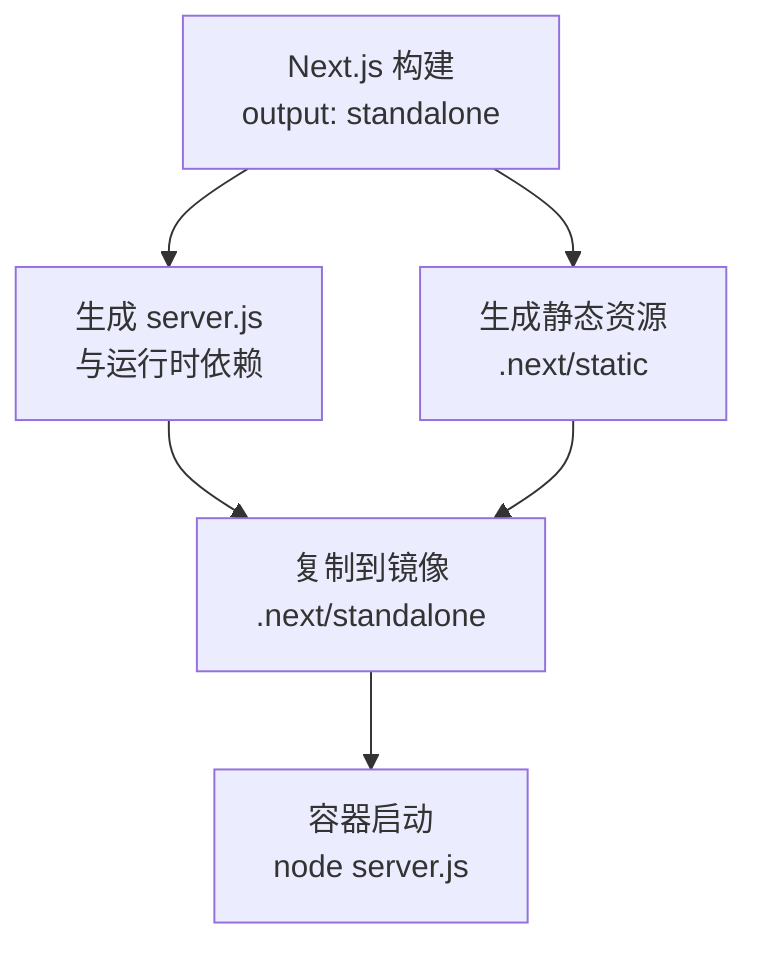
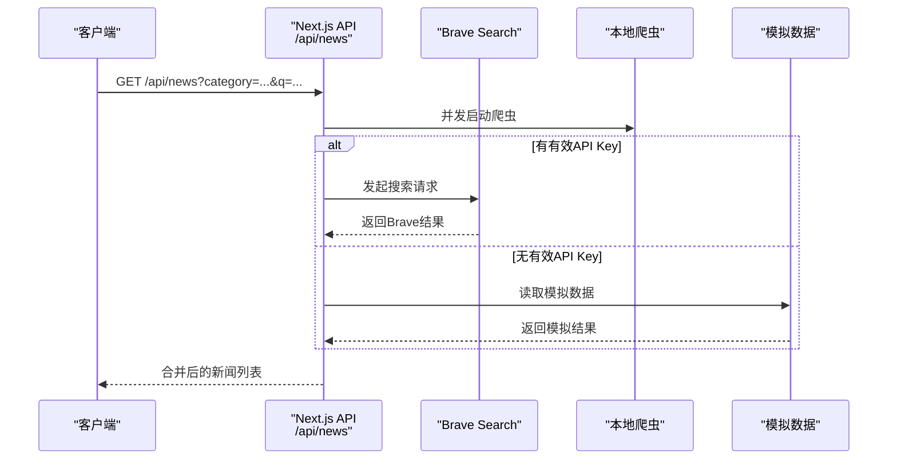
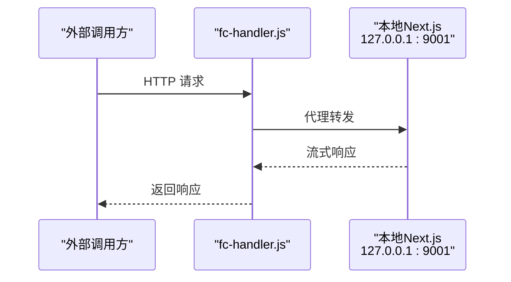
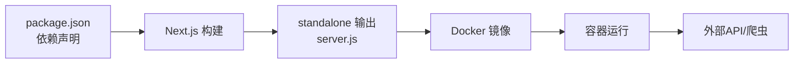

# Docker容器化部署

<cite>
**本文引用的文件**
- [Dockerfile](file://Dockerfile)
- [package.json](file://package.json)
- [next.config.mjs](file://next.config.mjs)
- [README.md](file://README.md)
- [启动网站.sh](file://启动网站.sh)
- [fc-handler.js](file://fc-handler.js)
- [s.yaml](file://s.yaml)
- [vercel.json](file://vercel.json)
- [app/page.tsx](file://app/page.tsx)
- [app/layout.tsx](file://app/layout.tsx)
- [app/api/news/route.ts](file://app/api/news/route.ts)
- [lib/brave-search.ts](file://lib/brave-search.ts)
- [lib/news-scraper.ts](file://lib/news-scraper.ts)
- [lib/mock-data.ts](file://lib/mock-data.ts)
- [components/NewsCard.tsx](file://components/NewsCard.tsx)
</cite>

## 目录
1. [简介](#简介)
2. [项目结构](#项目结构)
3. [核心组件](#核心组件)
4. [架构总览](#架构总览)
5. [详细组件分析](#详细组件分析)
6. [依赖关系分析](#依赖关系分析)
7. [性能考量](#性能考量)
8. [故障排查指南](#故障排查指南)
9. [结论](#结论)
10. [附录](#附录)

## 简介
本文件面向希望将新闻网站以Docker方式容器化的用户，基于仓库中的现有配置与源码，系统阐述镜像构建流程、多阶段构建优化思路、容器运行参数、端口映射与环境变量设置，并提供Compose编排与静态资源处理的最佳实践。项目采用Next.js 16的“独立输出”模式，配合Node.js Alpine基础镜像，实现轻量级、可直接运行的容器镜像。

## 项目结构
该仓库为一个基于Next.js的应用，核心目录与文件如下：
- 构建产物：.next/standalone 与 .next/static
- 应用入口：app/（页面、API路由、全局样式）
- 工具库：lib/（新闻抓取、模拟数据、Brave搜索接口）
- 组件：components/（UI组件）
- 配置：Dockerfile、next.config.mjs、vercel.json、s.yaml
- 启动脚本：启动网站.sh
- 云函数适配：fc-handler.js

图表来源
- [Dockerfile](file://Dockerfile#L1-L16)
- [next.config.mjs](file://next.config.mjs#L1-L10)
- [app/page.tsx](file://app/page.tsx#L1-L153)
- [lib/brave-search.ts](file://lib/brave-search.ts#L1-L115)
- [lib/news-scraper.ts](file://lib/news-scraper.ts#L1-L166)
- [lib/mock-data.ts](file://lib/mock-data.ts#L1-L197)
- [components/NewsCard.tsx](file://components/NewsCard.tsx#L1-L89)
- [vercel.json](file://vercel.json#L1-L11)
- [s.yaml](file://s.yaml#L1-L40)
- [启动网站.sh](file://启动网站.sh#L1-L9)
- [fc-handler.js](file://fc-handler.js#L1-L125)

章节来源
- [Dockerfile](file://Dockerfile#L1-L16)
- [next.config.mjs](file://next.config.mjs#L1-L10)
- [README.md](file://README.md#L1-L49)

## 核心组件
- Docker镜像构建
  - 基于官方Node.js Alpine镜像，工作目录设为/app
  - 将Next.js“独立输出”的server.js与静态资源复制进镜像
  - 设置生产环境变量（端口、主机绑定、运行模式）
  - 暴露容器端口并以node命令启动
- Next.js构建配置
  - output: 'standalone'，生成可独立运行的服务端进程
  - 图片优化：关闭未优化图片，启用内联内容类型
- 云函数适配层
  - fc-handler.js在本地通过HTTP代理转发请求到内部Next.js实例
  - 初始化器预热，轮询等待服务就绪
- API与数据流
  - app/api/news/route.ts统一聚合Brave搜索与本地爬虫数据
  - lib/brave-search.ts封装Brave API调用
  - lib/news-scraper.ts基于Cheerio解析Hacker News等站点
  - lib/mock-data.ts提供无API密钥时的回退数据
- 前端展示
  - app/page.tsx负责分类切换、搜索、收藏与加载状态
  - components/NewsCard.tsx渲染单条新闻卡片

章节来源
- [Dockerfile](file://Dockerfile#L1-L16)
- [next.config.mjs](file://next.config.mjs#L1-L10)
- [fc-handler.js](file://fc-handler.js#L1-L125)
- [app/api/news/route.ts](file://app/api/news/route.ts#L1-L136)
- [lib/brave-search.ts](file://lib/brave-search.ts#L1-L115)
- [lib/news-scraper.ts](file://lib/news-scraper.ts#L1-L166)
- [lib/mock-data.ts](file://lib/mock-data.ts#L1-L197)
- [app/page.tsx](file://app/page.tsx#L1-L153)
- [components/NewsCard.tsx](file://components/NewsCard.tsx#L1-L89)

## 架构总览
容器运行时，Next.js以独立进程启动，监听容器内的端口；若需要在云函数环境中运行，则由fc-handler.js作为适配层，将外部HTTP请求代理到内部Next.js实例。

图表来源
- [Dockerfile](file://Dockerfile#L1-L16)
- [fc-handler.js](file://fc-handler.js#L1-L125)

## 详细组件分析

### Dockerfile 分析
- 基础镜像与工作目录
  - 使用node:18-alpine，体积小、安全性较好
  - WORKDIR设为/app，后续COPY与CMD均在此上下文中执行
- 构建产物复制
  - 复制.next/standalone至根目录，包含可运行的server.js
  - 复制.next/static至镜像内，确保静态资源可用
- 环境变量与端口
  - 默认端口9000、HOSTNAME绑定0.0.0.0、NODE_ENV=production
  - EXPOSE暴露9000，便于容器编排与反向代理
- 启动命令
  - CMD以node server.js启动Next.js独立进程

图表来源
- [Dockerfile](file://Dockerfile#L1-L16)

章节来源
- [Dockerfile](file://Dockerfile#L1-L16)

### Next.js 独立输出与静态资源
- 独立输出模式
  - next.config.mjs将output设为standalone，构建后生成可直接运行的server.js
- 静态资源处理
  - .next/static包含构建期生成的静态文件，Dockerfile已将其复制进镜像
  - images.unoptimized=true，避免运行时额外处理图片，简化容器镜像与运行时开销
- 运行时优化
  - NODE_ENV=production，启用生产优化
  - HOSTNAME=0.0.0.0，允许容器外部访问

图表来源
- [next.config.mjs](file://next.config.mjs#L1-L10)
- [Dockerfile](file://Dockerfile#L1-L16)

章节来源
- [next.config.mjs](file://next.config.mjs#L1-L10)
- [Dockerfile](file://Dockerfile#L1-L16)

### API 聚合与容错
- API路径：/api/news
- 数据来源
  - Brave Search API：lib/brave-search.ts
  - 爬虫数据：lib/news-scraper.ts（Hacker News）
  - 回退数据：lib/mock-data.ts（无有效API Key时）
- 并发与合并
  - 同时发起Brave搜索与爬虫请求，合并结果并去重
  - 当Brave API异常时，自动回退到mock+scraped组合
- 查询参数
  - category：分类（all/tech/business/politics）
  - q：关键词搜索

图表来源
- [app/api/news/route.ts](file://app/api/news/route.ts#L1-L136)
- [lib/brave-search.ts](file://lib/brave-search.ts#L1-L115)
- [lib/news-scraper.ts](file://lib/news-scraper.ts#L1-L166)
- [lib/mock-data.ts](file://lib/mock-data.ts#L1-L197)

章节来源
- [app/api/news/route.ts](file://app/api/news/route.ts#L1-L136)
- [lib/brave-search.ts](file://lib/brave-search.ts#L1-L115)
- [lib/news-scraper.ts](file://lib/news-scraper.ts#L1-L166)
- [lib/mock-data.ts](file://lib/mock-data.ts#L1-L197)

### 云函数适配层（fc-handler.js）
- 初始化器
  - 在函数初始化阶段启动内部Next.js服务并轮询等待就绪
- HTTP处理器
  - 将外部HTTP请求代理到本地127.0.0.1:PORT
  - 跳过可能导致问题的响应头，流式传输响应
  - 设置超时与错误处理（502/504）

图表来源
- [fc-handler.js](file://fc-handler.js#L1-L125)

章节来源
- [fc-handler.js](file://fc-handler.js#L1-L125)

### 容器运行参数与端口映射
- 端口
  - 容器内监听9000端口（EXPOSE 9000）
  - 可通过-p映射到宿主端口，如8080:9000
- 环境变量
  - PORT：容器内监听端口，默认9000
  - HOSTNAME：绑定地址，默认0.0.0.0
  - NODE_ENV：生产模式
  - BRAVE_API_KEY：可选，用于启用真实新闻数据
- 命令
  - CMD ["node", "server.js"]

章节来源
- [Dockerfile](file://Dockerfile#L1-L16)
- [app/api/news/route.ts](file://app/api/news/route.ts#L1-L136)

### Docker Compose 编排示例与最佳实践
- 示例服务定义
  - 服务名：daily-news
  - 镜像：自构建（docker build -t daily-news .）
  - 端口映射：8080:9000
  - 环境变量：BRAVE_API_KEY（可选）
  - 卷挂载：可选挂载日志或缓存目录（视需求）
- 最佳实践
  - 使用只读根文件系统与最小权限
  - 设置健康检查（curl -f http://localhost:9000/_next/static/...）
  - 使用反向代理（Nginx/Traefik）统一入口与TLS终止
  - 限制CPU/内存资源，避免资源争用
  - 使用独立网络隔离数据库或外部API服务（如有）

（本节为概念性说明，不直接分析具体文件，故无章节来源）

## 依赖关系分析
- 构建期依赖
  - Next.js 16、React 19、cheerio、TailwindCSS等
- 运行期依赖
  - Node.js 18（Alpine）
  - 由standalone输出自带运行时依赖
- 外部依赖
  - Brave Search API（可选）
  - Hacker News（爬虫来源）

图表来源
- [package.json](file://package.json#L1-L30)
- [next.config.mjs](file://next.config.mjs#L1-L10)
- [Dockerfile](file://Dockerfile#L1-L16)

章节来源
- [package.json](file://package.json#L1-L30)
- [next.config.mjs](file://next.config.mjs#L1-L10)
- [Dockerfile](file://Dockerfile#L1-L16)

## 性能考量
- 镜像体积
  - 基于Alpine，结合standalone输出，镜像较小
- 启动速度
  - 云函数场景下，初始化器预热可减少首次请求延迟
- 静态资源
  - images.unoptimized=true，避免运行时图片处理开销
- 并发与回退
  - API与爬虫并发请求，提升响应速度；API失败时快速回退到mock数据

（本节提供一般性建议，不直接分析具体文件，故无章节来源）

## 故障排查指南
- 容器无法启动
  - 检查端口占用与防火墙规则
  - 查看容器日志，确认node server.js是否正常
- API无数据
  - 若BRAVE_API_KEY为空或占位值，将回退到mock数据
  - 确认网络可达Brave Search API
- 爬虫失败
  - 检查Hacker News可访问性与反爬机制
  - 观察控制台错误日志
- 云函数代理错误
  - 确认本地Next.js已在127.0.0.1:PORT就绪
  - 检查超时与错误响应（502/504）

章节来源
- [app/api/news/route.ts](file://app/api/news/route.ts#L1-L136)
- [lib/brave-search.ts](file://lib/brave-search.ts#L1-L115)
- [lib/news-scraper.ts](file://lib/news-scraper.ts#L1-L166)
- [fc-handler.js](file://fc-handler.js#L1-L125)

## 结论
本项目通过Next.js的standalone输出与Node.js Alpine镜像，实现了轻量、可直接运行的容器镜像。结合云函数适配层，可在多种运行环境中灵活部署。建议在生产中配合反向代理、健康检查与资源限制，确保稳定性与可观测性。

## 附录
- 本地开发
  - 使用启动网站.sh或npm run dev在本地运行
- 平台配置
  - vercel.json与s.yaml分别面向Vercel与阿里云函数的部署配置

章节来源
- [启动网站.sh](file://启动网站.sh#L1-L9)
- [vercel.json](file://vercel.json#L1-L11)
- [s.yaml](file://s.yaml#L1-L40)