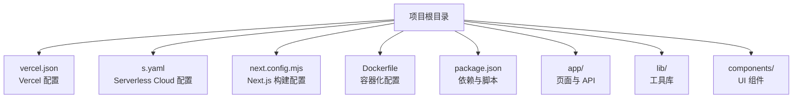
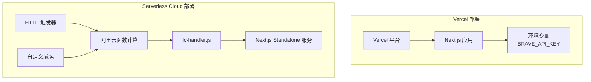
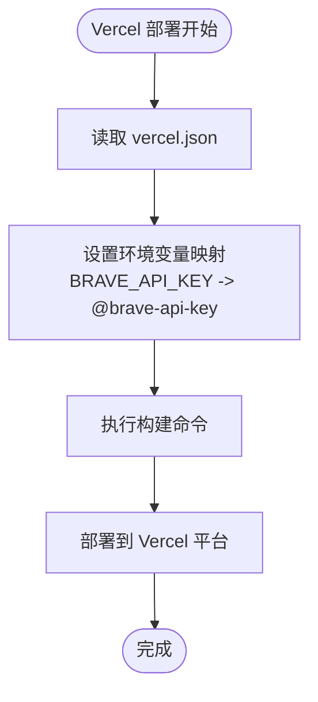
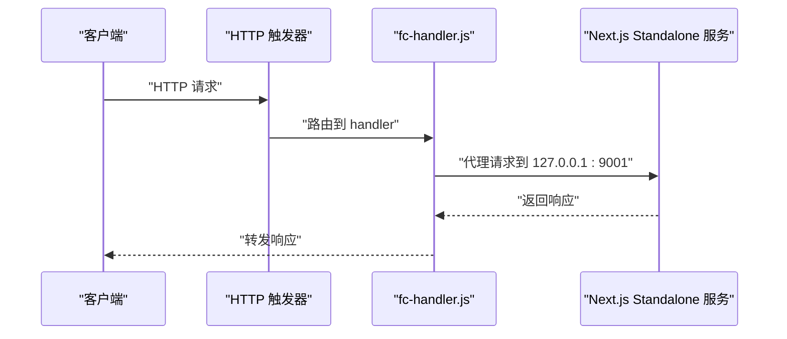
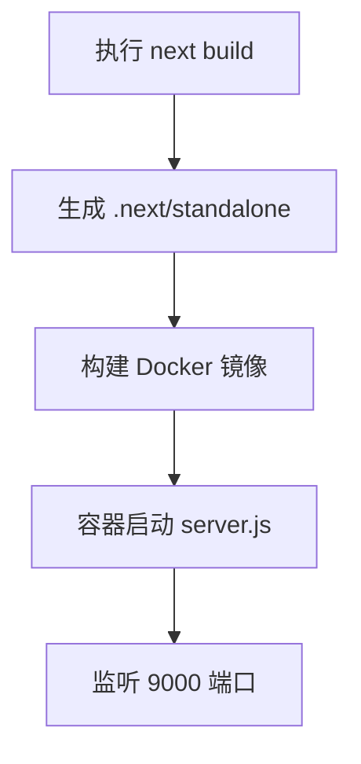
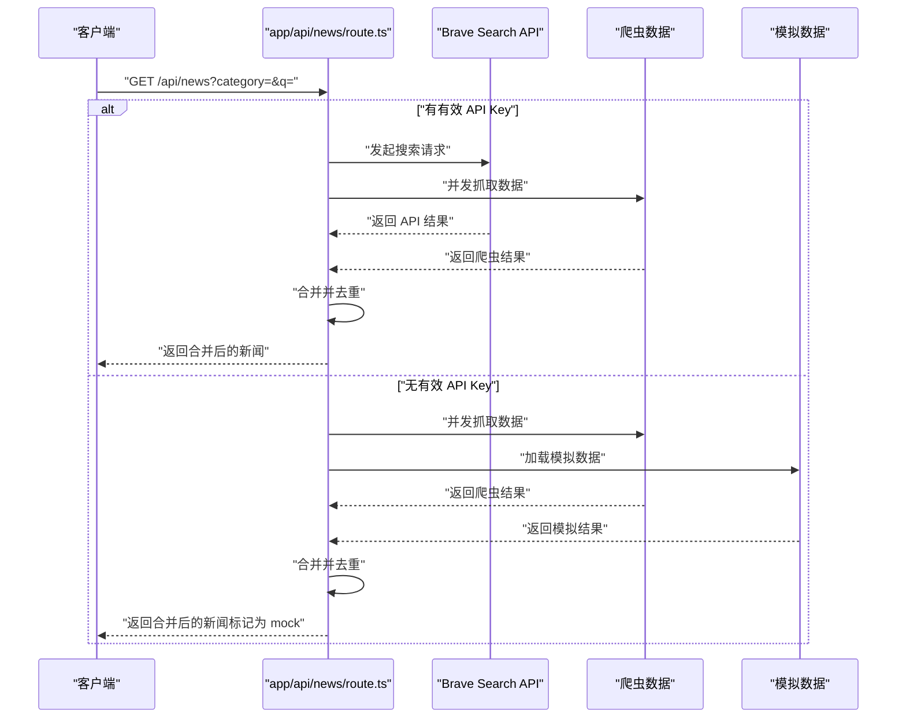
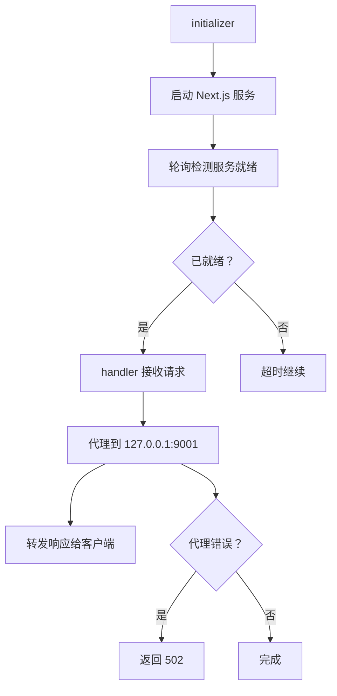
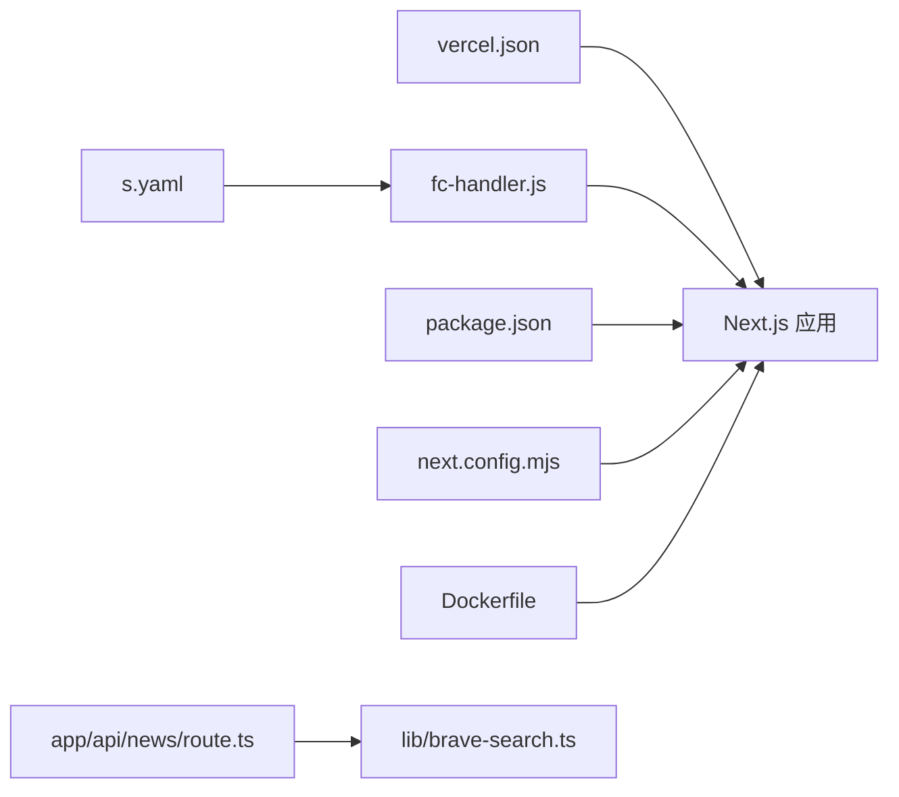

# 云平台部署

<cite>
**本文档引用的文件**
- [vercel.json](file://vercel.json)
- [s.yaml](file://s.yaml)
- [Dockerfile](file://Dockerfile)
- [package.json](file://package.json)
- [next.config.mjs](file://next.config.mjs)
- [fc-handler.js](file://fc-handler.js)
- [lib/brave-search.ts](file://lib/brave-search.ts)
- [app/api/news/route.ts](file://app/api/news/route.ts)
- [README.md](file://README.md)
</cite>

## 目录
1. [简介](#简介)
2. [项目结构](#项目结构)
3. [核心组件](#核心组件)
4. [架构总览](#架构总览)
5. [详细组件分析](#详细组件分析)
6. [依赖关系分析](#依赖关系分析)
7. [性能考虑](#性能考虑)
8. [故障排除指南](#故障排除指南)
9. [结论](#结论)
10. [附录](#附录)

## 简介
本项目是一个基于 Next.js 的新闻聚合应用，支持从 Brave Search API 获取新闻数据，并提供分类浏览、搜索、摘要和收藏功能。项目同时提供了两种云平台的部署配置：Vercel 和 Serverless Cloud（阿里云函数计算），涵盖构建设置、环境变量管理、函数配置、触发器设置、资源限制以及域名绑定等关键部署要素。

## 项目结构
项目采用 Next.js 应用结构，主要目录与文件如下：
- 配置文件：vercel.json（Vercel 部署配置）、s.yaml（Serverless Cloud 部署配置）、next.config.mjs（Next.js 构建配置）、Dockerfile（容器化部署）
- 源码：app/（页面与 API）、lib/（工具库）、components/（UI 组件）
- 包管理：package.json（依赖与脚本）

图表来源
- [vercel.json](file://vercel.json#L1-L11)
- [s.yaml](file://s.yaml#L1-L40)
- [next.config.mjs](file://next.config.mjs#L1-L10)
- [Dockerfile](file://Dockerfile#L1-L16)
- [package.json](file://package.json#L1-L30)

章节来源
- [vercel.json](file://vercel.json#L1-L11)
- [s.yaml](file://s.yaml#L1-L40)
- [next.config.mjs](file://next.config.mjs#L1-L10)
- [Dockerfile](file://Dockerfile#L1-L16)
- [package.json](file://package.json#L1-L30)

## 核心组件
- Vercel 配置：定义版本、构建命令、开发命令、安装命令、框架类型以及环境变量映射
- Serverless Cloud 配置：定义函数计算组件、运行时、CPU/内存/磁盘/超时、环境变量、触发器（HTTP）、自定义域名
- Next.js 构建配置：启用独立输出（standalone）以便在无 Node.js 运行时环境中运行
- 函数处理器（fc-handler.js）：在阿里云函数计算中代理请求到内部 Next.js 服务
- API 路由：app/api/news/route.ts 提供新闻查询接口，集成 Brave Search API 与爬虫数据
- 环境变量：BRAVE_API_KEY 在 Vercel 与 Serverless Cloud 中分别通过平台提供的密钥管理进行注入

章节来源
- [vercel.json](file://vercel.json#L1-L11)
- [s.yaml](file://s.yaml#L8-L40)
- [next.config.mjs](file://next.config.mjs#L1-L10)
- [fc-handler.js](file://fc-handler.js#L1-L137)
- [app/api/news/route.ts](file://app/api/news/route.ts#L1-L136)
- [lib/brave-search.ts](file://lib/brave-search.ts#L27-L28)

## 架构总览
下图展示了两种部署方式的总体架构：Vercel 直接托管 Next.js 应用；Serverless Cloud 使用函数计算承载应用并通过 HTTP 触发器接收请求，内部通过 fc-handler.js 将请求代理到 Next.js 服务。

图表来源
- [vercel.json](file://vercel.json#L7-L9)
- [s.yaml](file://s.yaml#L8-L40)
- [fc-handler.js](file://fc-handler.js#L14-L41)
- [next.config.mjs](file://next.config.mjs#L3-L3)

## 详细组件分析

### Vercel 配置详解
- 版本：使用 v2 配置格式
- 构建命令：通过 npm 脚本执行构建
- 开发命令：通过 npm 脚本启动开发服务器
- 安装命令：通过 npm 安装依赖
- 框架：指定为 Next.js
- 环境变量：BRAVE_API_KEY 通过 Vercel 的密钥别名进行映射

图表来源
- [vercel.json](file://vercel.json#L1-L11)

章节来源
- [vercel.json](file://vercel.json#L1-L11)

### Serverless Cloud 配置详解
- 组件：fc3（函数计算 v3）
- 运行时：Node.js 18
- 资源限制：CPU 0.5 核、内存 1024 MB、磁盘 512 MB、超时 120 秒
- 初始化器：initializer，用于预热 Next.js 服务
- 处理器：handler，代理请求到内部服务
- 触发器：HTTP 触发器，匿名认证，支持 GET/POST/PUT/DELETE
- 自定义域名：自动域名，HTTP 协议，路径通配符
- 环境变量：BRAVE_API_KEY 注入到函数环境

图表来源
- [s.yaml](file://s.yaml#L19-L24)
- [s.yaml](file://s.yaml#L25-L35)
- [fc-handler.js](file://fc-handler.js#L55-L136)

章节来源
- [s.yaml](file://s.yaml#L8-L40)
- [fc-handler.js](file://fc-handler.js#L1-L137)

### Next.js 构建与运行配置
- 输出模式：standalone，便于在无 Node.js 运行时环境中直接运行
- 图片优化：禁用自动优化，内容分发类型为内联
- Dockerfile：基于 node:18-alpine，复制构建产物，设置端口与启动命令

图表来源
- [next.config.mjs](file://next.config.mjs#L3-L8)
- [Dockerfile](file://Dockerfile#L1-L16)

章节来源
- [next.config.mjs](file://next.config.mjs#L1-L10)
- [Dockerfile](file://Dockerfile#L1-L16)

### API 路由与数据源
- API 路由：app/api/news/route.ts 提供 GET 接口，支持按分类或关键词查询
- 数据源：优先使用 Brave Search API，失败时回退到爬虫数据与模拟数据
- 去重合并：合并 API 与爬虫结果，避免重复条目
- 环境变量：BRAVE_API_KEY 用于 Brave Search API 认证

图表来源
- [app/api/news/route.ts](file://app/api/news/route.ts#L39-L135)
- [lib/brave-search.ts](file://lib/brave-search.ts#L30-L73)

章节来源
- [app/api/news/route.ts](file://app/api/news/route.ts#L1-L136)
- [lib/brave-search.ts](file://lib/brave-search.ts#L1-L115)

### 函数处理器（fc-handler.js）
- 初始化器：在函数初始化阶段启动内部 Next.js 服务并轮询等待就绪
- HTTP 处理器：将外部请求代理到内部服务，处理响应头与错误情况
- 超时与错误处理：设置代理超时与错误响应码，确保稳定性

图表来源
- [fc-handler.js](file://fc-handler.js#L44-L52)
- [fc-handler.js](file://fc-handler.js#L14-L41)
- [fc-handler.js](file://fc-handler.js#L55-L136)

章节来源
- [fc-handler.js](file://fc-handler.js#L1-L137)

## 依赖关系分析
- Vercel 与 Serverless Cloud 的配置文件分别定义了各自的构建与运行环境
- Next.js 构建配置与 Dockerfile 共同决定了应用的打包与运行方式
- API 路由依赖 Brave Search API 与爬虫模块，环境变量用于认证
- fc-handler.js 作为 Serverless Cloud 的入口，负责请求代理与服务生命周期管理

图表来源
- [vercel.json](file://vercel.json#L1-L11)
- [s.yaml](file://s.yaml#L8-L40)
- [fc-handler.js](file://fc-handler.js#L1-L137)
- [package.json](file://package.json#L1-L30)
- [next.config.mjs](file://next.config.mjs#L1-L10)
- [Dockerfile](file://Dockerfile#L1-L16)
- [app/api/news/route.ts](file://app/api/news/route.ts#L1-L136)
- [lib/brave-search.ts](file://lib/brave-search.ts#L1-L115)

章节来源
- [vercel.json](file://vercel.json#L1-L11)
- [s.yaml](file://s.yaml#L1-L40)
- [fc-handler.js](file://fc-handler.js#L1-L137)
- [package.json](file://package.json#L1-L30)
- [next.config.mjs](file://next.config.mjs#L1-L10)
- [Dockerfile](file://Dockerfile#L1-L16)
- [app/api/news/route.ts](file://app/api/news/route.ts#L1-L136)
- [lib/brave-search.ts](file://lib/brave-search.ts#L1-L115)

## 性能考虑
- 资源限制：Serverless Cloud 中 CPU 与内存配置适中，需根据实际流量调整
- 超时设置：函数超时与代理超时均设置为合理值，避免长时间占用
- 并发策略：API 路由中对多个数据源采用并发请求，提升响应速度
- 构建优化：使用 standalone 输出减少运行时依赖，提高冷启动效率

## 故障排除指南
- Brave API Key 缺失：当环境变量未正确配置时，API 路由会回退到模拟数据与爬虫数据
- 代理错误：fc-handler.js 对代理错误进行捕获并返回标准错误码
- 服务就绪：初始化器会轮询等待内部服务就绪，若超时则继续执行以避免阻塞

章节来源
- [app/api/news/route.ts](file://app/api/news/route.ts#L8-L11)
- [fc-handler.js](file://fc-handler.js#L115-L130)
- [fc-handler.js](file://fc-handler.js#L38-L41)

## 结论
本项目提供了完整的 Vercel 与 Serverless Cloud 部署方案，涵盖了构建配置、环境变量管理、函数配置与触发器设置、资源限制以及域名绑定等关键环节。通过合理的架构设计与错误处理机制，能够在不同云平台上稳定运行并提供良好的用户体验。

## 附录
- 启动说明：参考项目根目录下的启动脚本与 README
- API 文档：app/api/news/route.ts 提供的接口能力与参数说明

章节来源
- [README.md](file://README.md#L1-L49)