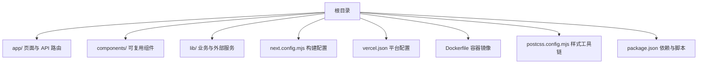
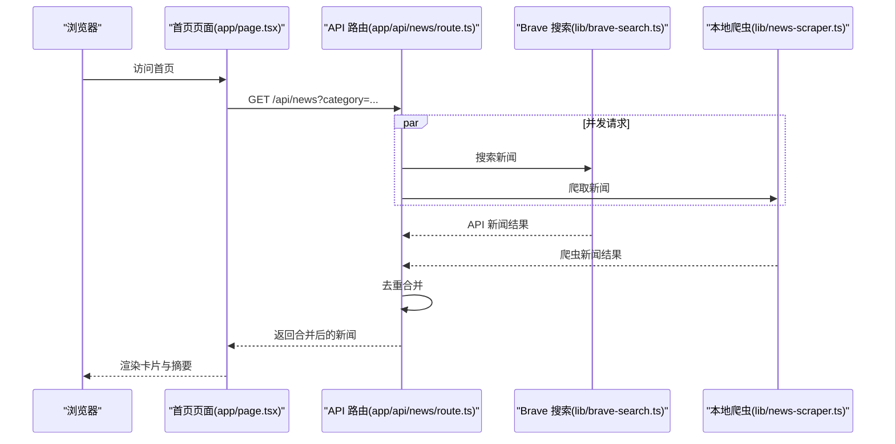
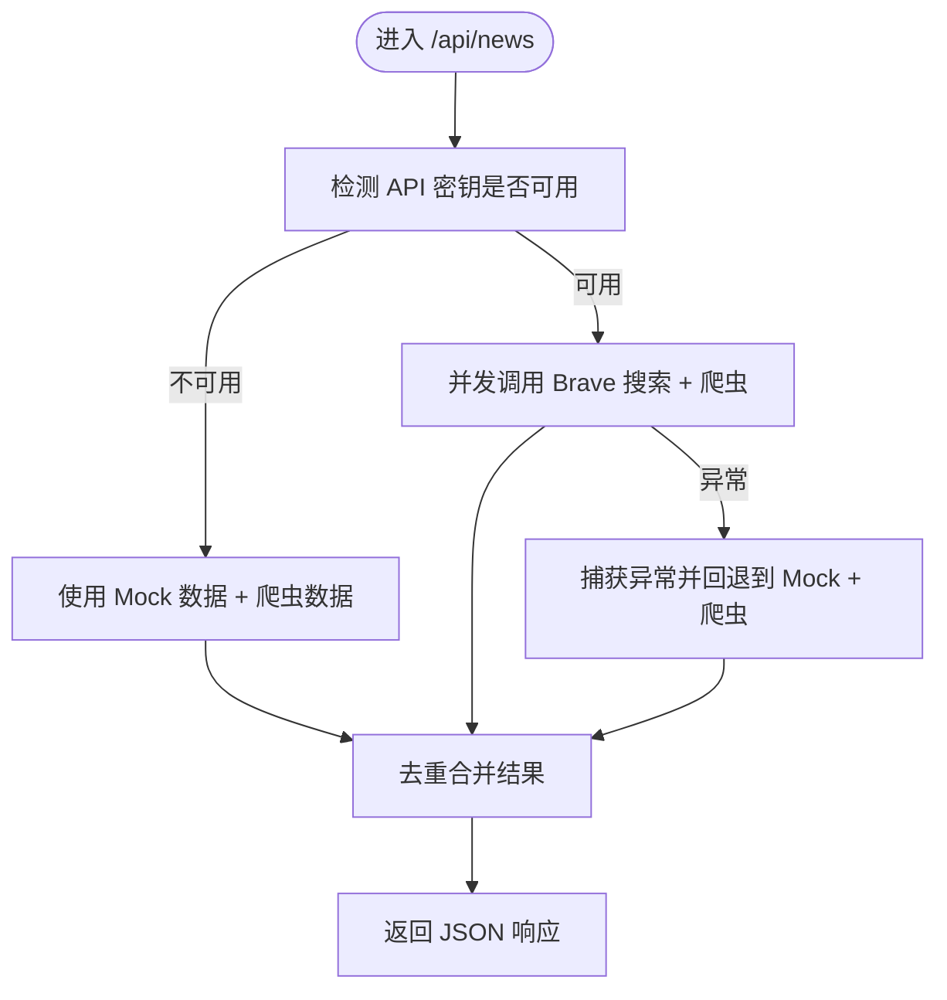
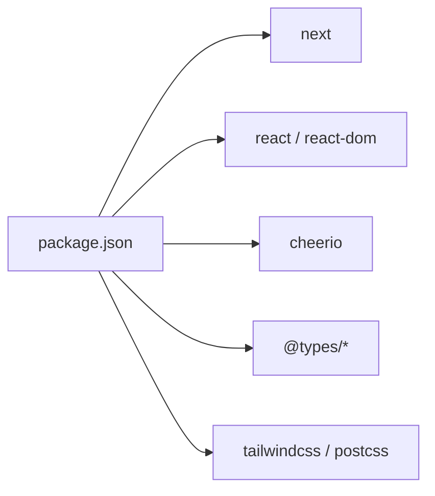

# 生产环境优化

<cite>
**本文引用的文件**
- [next.config.mjs](file://next.config.mjs)
- [package.json](file://package.json)
- [vercel.json](file://vercel.json)
- [Dockerfile](file://Dockerfile)
- [app/layout.tsx](file://app/layout.tsx)
- [app/page.tsx](file://app/page.tsx)
- [app/api/news/route.ts](file://app/api/news/route.ts)
- [lib/brave-search.ts](file://lib/brave-search.ts)
- [lib/news-scraper.ts](file://lib/news-scraper.ts)
- [lib/favorites.ts](file://lib/favorites.ts)
- [components/CategoryTabs.tsx](file://components/CategoryTabs.tsx)
- [components/SearchBar.tsx](file://components/SearchBar.tsx)
- [components/NewsSummary.tsx](file://components/NewsSummary.tsx)
- [postcss.config.mjs](file://postcss.config.mjs)
</cite>

## 目录
1. [引言](#引言)
2. [项目结构](#项目结构)
3. [核心组件](#核心组件)
4. [架构总览](#架构总览)
5. [详细组件分析](#详细组件分析)
6. [依赖分析](#依赖分析)
7. [性能考虑](#性能考虑)
8. [故障排查指南](#故障排查指南)
9. [结论](#结论)
10. [附录](#附录)

## 引言
本文件面向生产环境，系统化梳理该 Next.js 新闻应用在构建、运行、缓存与交付方面的优化策略与落地建议。重点覆盖：
- 构建配置与输出模式优化
- 代码分割与懒加载实践
- 缓存策略、CDN 与静态资源优化
- 环境变量与安全头配置
- 性能监控与基准测试方法
- 生产部署检查清单

## 项目结构
该仓库采用标准 Next.js App Router 结构，核心目录与职责如下：
- app：页面与 API 路由
- components：可复用 UI 组件
- lib：业务逻辑与外部服务集成
- 根级配置：构建、部署与框架适配文件

图表来源
- [next.config.mjs](file://next.config.mjs#L1-L10)
- [vercel.json](file://vercel.json#L1-L11)
- [Dockerfile](file://Dockerfile#L1-L16)
- [postcss.config.mjs](file://postcss.config.mjs#L1-L7)
- [package.json](file://package.json#L1-L30)

章节来源
- [next.config.mjs](file://next.config.mjs#L1-L10)
- [vercel.json](file://vercel.json#L1-L11)
- [Dockerfile](file://Dockerfile#L1-L16)
- [postcss.config.mjs](file://postcss.config.mjs#L1-L7)
- [package.json](file://package.json#L1-L30)

## 核心组件
- 应用布局与元数据：定义站点标题、描述与根节点语言，为 SEO 与基础体验提供统一入口。
- 首页页面：负责状态管理、数据拉取、错误处理与渲染骨架，是性能优化的关键入口。
- API 路由：聚合 Brave Search 与本地爬虫数据，实现降级与合并策略。
- 组件体系：分类标签、搜索栏、新闻摘要等，承担交互与展示职责。
- 工具模块：Brave 搜索封装、爬虫实现、收藏管理等。

章节来源
- [app/layout.tsx](file://app/layout.tsx#L1-L20)
- [app/page.tsx](file://app/page.tsx#L1-L153)
- [app/api/news/route.ts](file://app/api/news/route.ts#L1-L136)
- [lib/brave-search.ts](file://lib/brave-search.ts#L1-L115)
- [lib/news-scraper.ts](file://lib/news-scraper.ts#L1-L166)
- [lib/favorites.ts](file://lib/favorites.ts#L1-L29)
- [components/CategoryTabs.tsx](file://components/CategoryTabs.tsx#L1-L49)
- [components/SearchBar.tsx](file://components/SearchBar.tsx#L1-L37)
- [components/NewsSummary.tsx](file://components/NewsSummary.tsx#L1-L54)

## 架构总览
应用采用“客户端页面 + 服务端 API 路由”的混合架构。首页通过 fetch 调用 /api/news，API 路由并发拉取 Brave Search 与本地爬虫数据，进行去重合并后返回给客户端渲染。

图表来源
- [app/page.tsx](file://app/page.tsx#L19-L42)
- [app/api/news/route.ts](file://app/api/news/route.ts#L39-L96)
- [lib/brave-search.ts](file://lib/brave-search.ts#L30-L73)
- [lib/news-scraper.ts](file://lib/news-scraper.ts#L116-L138)

## 详细组件分析

### 构建与输出配置（next.config.mjs）
- 输出模式：使用独立可执行输出，便于容器化与快速启动。
- 图片策略：关闭 Next.js 图片优化，避免额外处理开销；如需优化图片，建议启用并配合 CDN。
- 内容分发类型：内联模式，适合静态资源较少场景。

章节来源
- [next.config.mjs](file://next.config.mjs#L1-L10)

### API 路由与数据聚合（app/api/news/route.ts）
- 并发策略：同时发起 Brave 搜索与本地爬虫请求，缩短首屏等待时间。
- 降级机制：当未配置有效 API 密钥或外部接口异常时，回退到 Mock 数据与爬虫数据合并。
- 去重策略：基于标题标准化去重，保证结果唯一性。
- 错误处理：捕获异常并回退，确保用户体验稳定。

图表来源
- [app/api/news/route.ts](file://app/api/news/route.ts#L7-L134)

章节来源
- [app/api/news/route.ts](file://app/api/news/route.ts#L1-L136)

### 客户端页面与懒加载（app/page.tsx）
- 状态与副作用：集中管理新闻、分类、收藏与错误状态；在挂载时按分类拉取数据。
- 懒加载策略：页面组件本身已标记为客户端组件，结合 App Router 的路由级代码分割，实现按需加载。
- 骨架屏：在加载阶段渲染占位元素，提升感知性能。
- 错误提示：对外部 API 失败提供用户可见的错误信息。

章节来源
- [app/page.tsx](file://app/page.tsx#L1-L153)

### 组件层优化（CategoryTabs、SearchBar、NewsSummary）
- 分类标签：以按钮形式切换分类，减少不必要的重渲染。
- 搜索栏：表单提交触发查询，避免频繁请求抖动。
- 新闻摘要：仅在非收藏模式下渲染，降低 DOM 体积。

章节来源
- [components/CategoryTabs.tsx](file://components/CategoryTabs.tsx#L1-L49)
- [components/SearchBar.tsx](file://components/SearchBar.tsx#L1-L37)
- [components/NewsSummary.tsx](file://components/NewsSummary.tsx#L1-L54)

### 外部服务集成（Brave 搜索与本地爬虫）
- Brave 搜索：支持 gzip 压缩头部，减少传输体积；若 API 失败则回退至 Web 搜索。
- 本地爬虫：对特定站点进行选择器解析，补充热点内容；异常时记录日志并继续流程。

章节来源
- [lib/brave-search.ts](file://lib/brave-search.ts#L27-L73)
- [lib/news-scraper.ts](file://lib/news-scraper.ts#L94-L138)

### 收藏功能（localStorage）
- 客户端存储：收藏项保存于本地存储，切换收藏即时更新 UI。
- 性能影响：避免服务端往返，但需注意存储上限与跨设备同步问题。

章节来源
- [lib/favorites.ts](file://lib/favorites.ts#L1-L29)

### 样式与工具链（postcss.config.mjs）
- Tailwind 插件：通过 PostCSS 启用 Tailwind 功能，建议在生产中开启 Purge 以移除未使用样式。

章节来源
- [postcss.config.mjs](file://postcss.config.mjs#L1-L7)

## 依赖分析
- 运行时依赖：Next.js、React、Cheerio 等。
- 开发依赖：Tailwind、PostCSS、TypeScript 等。
- 构建脚本：dev/build/start/lint。

图表来源
- [package.json](file://package.json#L15-L28)

章节来源
- [package.json](file://package.json#L1-L30)

## 性能考虑

### 构建配置优化
- 输出模式：当前使用独立可执行输出，利于容器化部署；如需进一步减小镜像体积，可在容器层做多阶段构建与精简。
- 图片优化：当前关闭图片优化；如存在大量图片，建议启用并配合 CDN。
- 构建产物：利用 .next/static 与 .next/standalone，确保静态资源与运行时文件完整复制。

章节来源
- [next.config.mjs](file://next.config.mjs#L3-L7)
- [Dockerfile](file://Dockerfile#L5-L7)

### 代码分割与懒加载
- 路由级分割：App Router 默认按路由拆分包，结合客户端组件标记，实现按需加载。
- 组件级懒加载：对非首屏使用的重型组件可采用动态导入，进一步降低首屏 JS 体积。
- 依赖拆分：将第三方库与业务代码分离，提升缓存命中率。

### 缓存策略
- 浏览器缓存：静态资源通过 Next.js 自动指纹命名与长期缓存策略，建议在 CDN 层设置合理的 Cache-Control。
- API 缓存：对不频繁变化的数据（如分类关键词）可增加边缘缓存；对实时新闻建议短 TTL 或条件缓存。
- 存储缓存：客户端 localStorage 用于收藏与偏好，建议设置过期策略与容量上限。

### CDN 与静态资源优化
- CDN：将静态资源与构建产物托管至 CDN，结合全球节点加速访问。
- 压缩：启用 gzip/br 压缩，减少传输体积。
- 图片优化：如启用图片优化，建议配置合适的尺寸与格式（WebP/JPEG），并使用响应式图片。

### 环境变量与安全头
- 环境变量：在平台配置中注入敏感变量（如 Brave API Key），避免硬编码。
- 安全头：建议在网关或中间层设置安全头（如 CSP、HSTS、X-Frame-Options 等），提升安全性。

章节来源
- [vercel.json](file://vercel.json#L7-L9)

### 性能监控与基准测试
- 监控指标：LCP、INP、CLS、TTFB、FCP、TTI 等。
- 工具：使用 Lighthouse、WebPageTest、Sentry、SaaS 性能平台等。
- 基准测试：在相同硬件与网络条件下定期跑测，建立基线并跟踪回归。

## 故障排查指南
- API 密钥缺失：当未配置有效密钥时，API 路由会回退到 Mock 数据与爬虫数据合并；检查平台环境变量配置。
- 外部接口异常：API 路由捕获异常并回退；查看日志定位具体上游错误。
- 爬虫失败：爬虫对单站点失败不会阻断整体流程；检查目标站点结构变更与反爬策略。
- 客户端错误：页面对网络错误提供用户提示；检查网络连通性与代理配置。

章节来源
- [app/api/news/route.ts](file://app/api/news/route.ts#L48-L74)
- [lib/brave-search.ts](file://lib/brave-search.ts#L55-L58)
- [lib/news-scraper.ts](file://lib/news-scraper.ts#L104-L113)
- [app/page.tsx](file://app/page.tsx#L30-L36)

## 结论
该应用已具备良好的并发数据聚合与降级回退能力，结合独立输出与容器化部署，满足生产环境的可维护性与可扩展性。建议在现有基础上完善图片优化、CDN 与缓存策略、安全头配置以及性能监控体系，以获得更优的用户体验与运维效率。

## 附录

### 生产环境部署检查清单
- [ ] 构建产物完整复制至容器（.next/static 与 .next/standalone）
- [ ] 环境变量正确注入（如 Brave API Key）
- [ ] CDN 已接入并配置缓存策略
- [ ] 安全头已在网关或中间层生效
- [ ] 性能监控与告警已配置
- [ ] 日志采集与错误追踪已启用
- [ ] 容灾与回滚策略已准备

### 性能基准测试方法
- [ ] 使用 Lighthouse 生成报告并对比基线
- [ ] 在不同网络与设备上重复测试
- [ ] 关注关键指标：LCP、INP、CLS、TTFB、FCP、TTI
- [ ] 对比启用/禁用缓存、CDN 与图片优化前后的差异