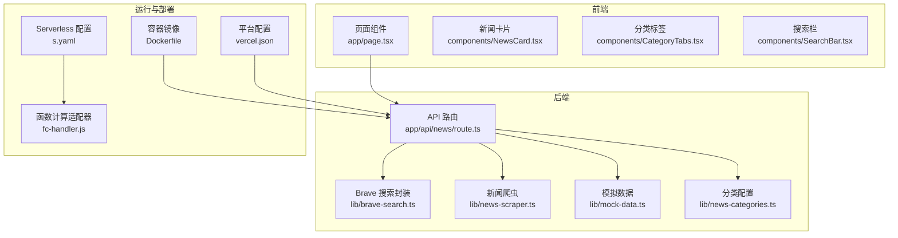
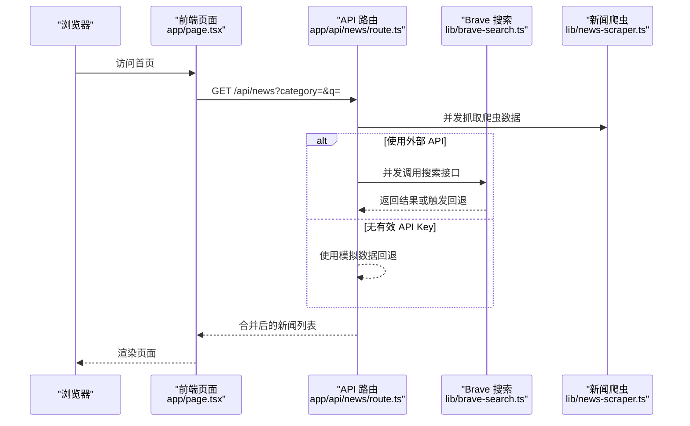
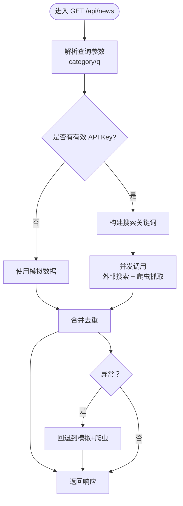
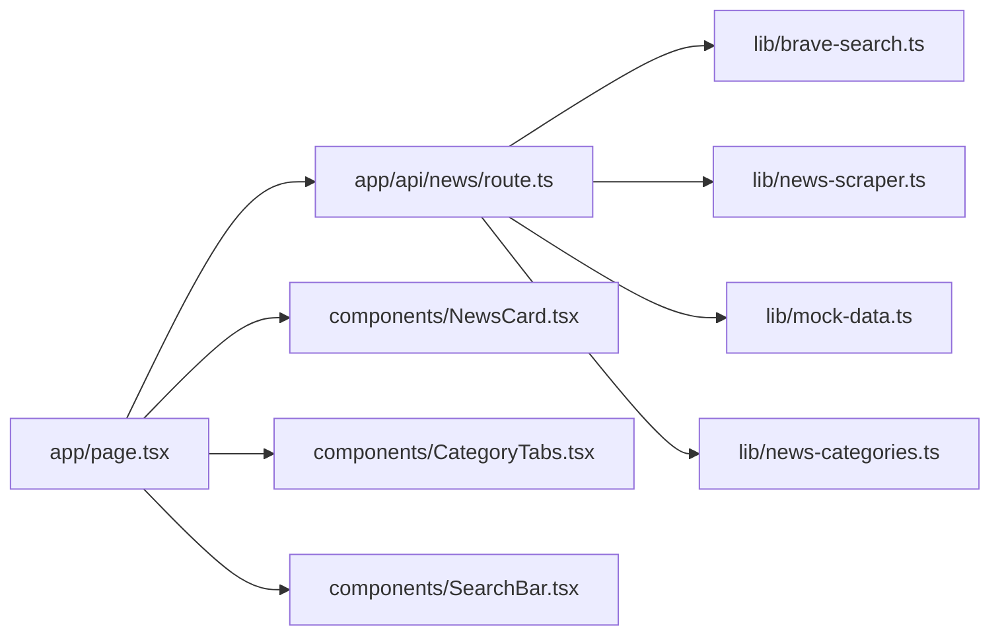
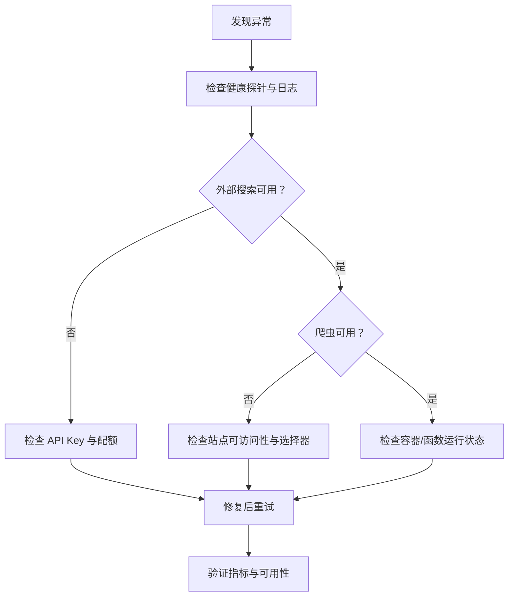

# 监控和维护

<cite>
**本文引用的文件**
- [README.md](file://README.md)
- [package.json](file://package.json)
- [Dockerfile](file://Dockerfile)
- [next.config.mjs](file://next.config.mjs)
- [vercel.json](file://vercel.json)
- [s.yaml](file://s.yaml)
- [fc-handler.js](file://fc-handler.js)
- [app/api/news/route.ts](file://app/api/news/route.ts)
- [lib/brave-search.ts](file://lib/brave-search.ts)
- [lib/news-scraper.ts](file://lib/news-scraper.ts)
- [lib/mock-data.ts](file://lib/mock-data.ts)
- [lib/news-categories.ts](file://lib/news-categories.ts)
- [lib/favorites.ts](file://lib/favorites.ts)
- [app/page.tsx](file://app/page.tsx)
- [app/layout.tsx](file://app/layout.tsx)
- [components/NewsCard.tsx](file://components/NewsCard.tsx)
- [components/CategoryTabs.tsx](file://components/CategoryTabs.tsx)
- [components/SearchBar.tsx](file://components/SearchBar.tsx)
</cite>

## 目录
1. [简介](#简介)
2. [项目结构](#项目结构)
3. [核心组件](#核心组件)
4. [架构总览](#架构总览)
5. [详细组件分析](#详细组件分析)
6. [依赖分析](#依赖分析)
7. [性能考量](#性能考量)
8. [故障排查指南](#故障排查指南)
9. [结论](#结论)
10. [附录](#附录)

## 简介
本文件面向新闻网站的运维与开发团队，提供一套可操作的监控与维护实践方案。内容涵盖健康检查配置、性能指标监控、错误日志收集、告警规则设置、故障排查流程、应急响应预案、日志分析方法、性能瓶颈识别与系统容量规划，以及定期维护任务、安全更新与备份策略。文档以仓库现有代码为依据，结合部署与运行环境（Docker、Serverless、Vercel）给出落地建议。

## 项目结构
该新闻网站采用 Next.js 应用，前端页面通过 API 路由聚合两类数据源：外部搜索 API（Brave Search）与本地爬虫抓取。应用支持容器化部署与 Serverless 托管两种方式；同时提供 Vercel 部署配置。

图表来源
- [Dockerfile](file://Dockerfile#L1-L16)
- [s.yaml](file://s.yaml#L1-L38)
- [vercel.json](file://vercel.json#L1-L11)
- [fc-handler.js](file://fc-handler.js#L1-L114)
- [app/api/news/route.ts](file://app/api/news/route.ts#L1-L136)
- [lib/brave-search.ts](file://lib/brave-search.ts#L1-L115)
- [lib/news-scraper.ts](file://lib/news-scraper.ts#L1-L166)
- [lib/mock-data.ts](file://lib/mock-data.ts#L1-L197)
- [lib/news-categories.ts](file://lib/news-categories.ts#L1-L45)
- [app/page.tsx](file://app/page.tsx#L1-L153)
- [components/NewsCard.tsx](file://components/NewsCard.tsx#L1-L89)
- [components/CategoryTabs.tsx](file://components/CategoryTabs.tsx#L1-L49)
- [components/SearchBar.tsx](file://components/SearchBar.tsx#L1-L37)

章节来源
- [README.md](file://README.md#L1-L49)
- [package.json](file://package.json#L1-L30)
- [Dockerfile](file://Dockerfile#L1-L16)
- [next.config.mjs](file://next.config.mjs#L1-L10)
- [vercel.json](file://vercel.json#L1-L11)
- [s.yaml](file://s.yaml#L1-L38)

## 核心组件
- API 路由：统一入口，负责参数解析、并发拉取两类数据源、合并去重、错误回退与响应构造。
- 搜索封装：封装 Brave Search API 请求与回退逻辑，处理异常与回退到网页搜索。
- 爬虫模块：基于 Cheerio 解析指定站点，按分类抓取标题与链接，构造标准新闻项。
- 模拟数据：在未配置 API 密钥时提供稳定回退数据，保障可用性。
- 前端页面：发起 /api/news 请求，展示新闻列表、分类切换、搜索与收藏。
- 运行时与部署：Docker 容器镜像、Serverless 配置与函数计算适配器、Vercel 平台配置。

章节来源
- [app/api/news/route.ts](file://app/api/news/route.ts#L1-L136)
- [lib/brave-search.ts](file://lib/brave-search.ts#L1-L115)
- [lib/news-scraper.ts](file://lib/news-scraper.ts#L1-L166)
- [lib/mock-data.ts](file://lib/mock-data.ts#L1-L197)
- [app/page.tsx](file://app/page.tsx#L1-L153)
- [fc-handler.js](file://fc-handler.js#L1-L114)

## 架构总览
系统采用“前端渲染 + 后端 API 聚合”的模式。API 层同时并发拉取外部搜索与本地爬虫数据，合并后返回给前端。当外部 API 不可用时，自动回退到模拟数据与爬虫数据的组合，确保服务连续性。

图表来源
- [app/page.tsx](file://app/page.tsx#L19-L38)
- [app/api/news/route.ts](file://app/api/news/route.ts#L39-L135)
- [lib/brave-search.ts](file://lib/brave-search.ts#L30-L73)
- [lib/news-scraper.ts](file://lib/news-scraper.ts#L140-L153)

## 详细组件分析

### API 路由与数据聚合
- 参数解析：从查询字符串读取分类与关键词，支持空查询时按分类关键字检索。
- 并发策略：同时启动爬虫抓取与外部搜索，缩短整体延迟。
- 合并与去重：以标题标准化为键，优先保留 API 来源，再追加爬虫数据，避免重复。
- 错误回退：外部 API 异常时，自动回退到模拟数据与爬虫数据的组合，保证可用性。
- 响应结构：包含数据来源统计、时间戳与是否使用模拟数据标记，便于监控与排障。

图表来源
- [app/api/news/route.ts](file://app/api/news/route.ts#L39-L135)

章节来源
- [app/api/news/route.ts](file://app/api/news/route.ts#L1-L136)

### 搜索封装（Brave Search）
- 关键点：校验 API Key，构造查询参数，设置必要请求头；若新闻搜索失败则回退到网页搜索。
- 异常处理：对外抛出错误，供上层路由捕获并执行回退策略。
- 输出标准化：统一映射为标准新闻项结构，包含来源域名、发布时间描述等。

章节来源
- [lib/brave-search.ts](file://lib/brave-search.ts#L1-L115)

### 新闻爬虫
- 配置：按分类映射到不同站点与选择器，定义解析器。
- 抓取流程：逐个来源抓取 HTML，加载 Cheerio，按限制数量提取条目。
- 错误处理：单个来源失败不影响整体，记录错误日志并继续处理其他来源。
- 输出标准化：统一映射为标准新闻项结构。

章节来源
- [lib/news-scraper.ts](file://lib/news-scraper.ts#L1-L166)

### 模拟数据
- 作用：在无有效 API Key 时提供稳定回退数据，保障用户体验。
- 结构：按分类预置示例新闻，字段与真实数据一致，便于前端渲染。

章节来源
- [lib/mock-data.ts](file://lib/mock-data.ts#L1-L197)

### 前端页面与交互
- 数据获取：通过 fetch 调用 /api/news，处理响应与错误状态。
- 用户体验：加载态骨架屏、错误提示、收藏切换、分类切换与搜索提交。
- 本地收藏：基于 localStorage 存储用户收藏，支持增删查与收藏页切换。

章节来源
- [app/page.tsx](file://app/page.tsx#L1-L153)
- [lib/favorites.ts](file://lib/favorites.ts#L1-L29)
- [components/NewsCard.tsx](file://components/NewsCard.tsx#L1-L89)
- [components/CategoryTabs.tsx](file://components/CategoryTabs.tsx#L1-L49)
- [components/SearchBar.tsx](file://components/SearchBar.tsx#L1-L37)

### 运行时与部署
- Docker：基于 standalone 构建产物，设置生产环境变量与端口，CMD 启动 server.js。
- Serverless（SLS）：定义函数计算资源、CPU/内存/磁盘、超时、环境变量、触发器与自定义域名。
- 函数计算适配器（FC）：在本地 127.0.0.1:9001 上代理请求，等待 Next 服务器就绪，否则返回 503。
- Vercel：框架类型、构建命令、开发命令、安装命令与环境变量配置。

章节来源
- [Dockerfile](file://Dockerfile#L1-L16)
- [s.yaml](file://s.yaml#L1-L38)
- [fc-handler.js](file://fc-handler.js#L1-L114)
- [vercel.json](file://vercel.json#L1-L11)

## 依赖分析
- 外部依赖：Next.js、React、Cheerio、Brave Search API。
- 内部模块：API 路由依赖搜索封装、爬虫模块、模拟数据与分类配置。
- 前端依赖：页面组件依赖 UI 组件与收藏工具。

图表来源
- [app/api/news/route.ts](file://app/api/news/route.ts#L1-L136)
- [lib/brave-search.ts](file://lib/brave-search.ts#L1-L115)
- [lib/news-scraper.ts](file://lib/news-scraper.ts#L1-L166)
- [lib/mock-data.ts](file://lib/mock-data.ts#L1-L197)
- [lib/news-categories.ts](file://lib/news-categories.ts#L1-L45)
- [app/page.tsx](file://app/page.tsx#L1-L153)
- [components/NewsCard.tsx](file://components/NewsCard.tsx#L1-L89)
- [components/CategoryTabs.tsx](file://components/CategoryTabs.tsx#L1-L49)
- [components/SearchBar.tsx](file://components/SearchBar.tsx#L1-L37)

## 性能考量
- 并发优化：API 层同时拉取外部搜索与爬虫数据，减少总体等待时间。
- 去重策略：以标题标准化为键，避免重复，提升渲染效率与用户体验。
- 缓存与回退：在 API 失败时快速回退到模拟数据与爬虫数据，保障稳定性。
- 图片与静态资源：Next 配置为 standalone 输出，有利于容器化部署与冷启动优化。
- 端口与主机：容器暴露固定端口，函数计算适配器在本地 127.0.0.1:9001 代理，需确保端口与主机绑定正确。

章节来源
- [app/api/news/route.ts](file://app/api/news/route.ts#L44-L96)
- [lib/brave-search.ts](file://lib/brave-search.ts#L30-L73)
- [lib/news-scraper.ts](file://lib/news-scraper.ts#L140-L153)
- [Dockerfile](file://Dockerfile#L9-L13)
- [fc-handler.js](file://fc-handler.js#L24-L57)

## 故障排查指南
- 健康检查
  - HTTP 探针：对 /api/news 发起 GET 请求，验证响应中包含 news 字段且长度大于 0。
  - 关键路径：确认 API Key 是否配置、Brave 搜索接口是否可达、爬虫站点是否可访问。
- 日志收集
  - API 层：在外部搜索异常时打印错误日志，随后回退到模拟+爬虫数据。
  - 爬虫层：对单个来源抓取失败进行错误记录，不影响整体流程。
  - 函数计算适配器：记录等待服务器就绪过程与代理结果，出现 503 时提示“服务启动中”。
- 常见问题定位
  - 无有效 API Key：返回模拟数据，检查环境变量配置。
  - 外部搜索失败：查看日志中的错误信息，确认 Brave API Key 与配额。
  - 爬虫抓取失败：检查目标站点可访问性与选择器是否匹配。
  - 503 提示：函数计算适配器等待服务器超时，检查容器或函数运行状态。
- 修复步骤
  - 补充或修正 API Key。
  - 重试外部搜索或切换到网页搜索回退路径。
  - 修复爬虫选择器或更换来源。
  - 重启容器或函数实例，确保 server.js 正常监听。

章节来源
- [app/api/news/route.ts](file://app/api/news/route.ts#L76-L134)
- [lib/brave-search.ts](file://lib/brave-search.ts#L55-L58)
- [lib/news-scraper.ts](file://lib/news-scraper.ts#L104-L113)
- [fc-handler.js](file://fc-handler.js#L80-L98)

## 结论
本项目通过“外部搜索 + 本地爬虫 + 模拟数据”的三层回退机制，在保证用户体验的同时提升了系统韧性。结合容器化与 Serverless/平台部署，可实现弹性伸缩与低成本运维。建议在生产环境中完善监控与告警、建立日志分析与容量规划流程，并制定定期维护与应急响应预案，以持续保障服务稳定与性能。

## 附录

### 健康检查配置建议
- HTTP 探针：对 /api/news 发起 GET 请求，期望响应包含 news 字段且长度大于 0。
- 关键指标：响应时间、成功率、外部搜索与爬虫数据占比。
- 告警阈值：响应时间超过阈值、成功率低于阈值、外部搜索失败率上升。

章节来源
- [app/api/news/route.ts](file://app/api/news/route.ts#L39-L111)

### 性能指标监控建议
- 关键指标
  - 延迟：外部搜索耗时、爬虫抓取耗时、合并耗时。
  - 吞吐：每分钟请求数、每秒响应数。
  - 资源：CPU、内存、磁盘使用率。
  - 可用性：成功率、错误率、外部搜索失败率。
- 指标来源：API 路由响应结构中的时间戳与 sources 统计字段可用于计算与可视化。

章节来源
- [app/api/news/route.ts](file://app/api/news/route.ts#L101-L111)

### 错误日志收集与分析
- 日志位置
  - API 层：外部搜索异常时的错误日志。
  - 爬虫层：单个来源抓取失败的日志。
  - 函数计算适配器：等待服务器与代理过程的日志。
- 分析方法
  - 统计错误类型与频率，识别外部 API 限流、站点变更或解析器失效。
  - 对比模拟数据与真实数据占比，评估外部搜索稳定性。

章节来源
- [app/api/news/route.ts](file://app/api/news/route.ts#L112-L118)
- [lib/brave-search.ts](file://lib/brave-search.ts#L55-L58)
- [lib/news-scraper.ts](file://lib/news-scraper.ts#L104-L113)
- [fc-handler.js](file://fc-handler.js#L78-L98)

### 告警规则设置
- 规则示例
  - 外部搜索失败率超过阈值。
  - API 响应时间 P95 超过阈值。
  - 成功率连续下降。
  - 爬虫抓取失败次数激增。
- 响应动作
  - 自动通知值班人员。
  - 触发回退策略或降级开关。
  - 启动应急预案（如切换到网页搜索回退路径）。

章节来源
- [lib/brave-search.ts](file://lib/brave-search.ts#L55-L58)
- [app/api/news/route.ts](file://app/api/news/route.ts#L112-L134)

### 故障排查流程

图表来源
- [app/api/news/route.ts](file://app/api/news/route.ts#L76-L134)
- [lib/brave-search.ts](file://lib/brave-search.ts#L30-L73)
- [lib/news-scraper.ts](file://lib/news-scraper.ts#L94-L138)
- [fc-handler.js](file://fc-handler.js#L80-L98)

### 应急响应预案
- 外部搜索不可用
  - 切换到网页搜索回退路径。
  - 通知用户当前为回退模式并提供预计恢复时间。
- 爬虫不可用
  - 临时减少抓取数量或更换来源。
  - 通知并安排修复解析器。
- 服务启动中
  - 函数计算适配器返回 503，引导用户稍后再试。
  - 检查容器或函数实例状态，必要时重启。

章节来源
- [lib/brave-search.ts](file://lib/brave-search.ts#L75-L99)
- [fc-handler.js](file://fc-handler.js#L90-L98)

### 日志分析方法
- 结构化日志：在关键路径输出结构化字段（如来源、耗时、状态码）。
- 时间序列：按分钟/小时统计成功率、失败率与延迟分布。
- 根因分析：对比外部搜索与爬虫数据占比，定位异常来源。

章节来源
- [app/api/news/route.ts](file://app/api/news/route.ts#L101-L111)
- [lib/brave-search.ts](file://lib/brave-search.ts#L30-L73)
- [lib/news-scraper.ts](file://lib/news-scraper.ts#L140-L153)

### 性能瓶颈识别
- 外部搜索：关注 API 响应时间与失败率，必要时启用回退路径。
- 爬虫：关注抓取耗时与解析器稳定性，优化选择器与并发。
- 合并去重：在数据量增大时评估算法复杂度，必要时引入更高效去重策略。

章节来源
- [app/api/news/route.ts](file://app/api/news/route.ts#L14-L37)
- [lib/brave-search.ts](file://lib/brave-search.ts#L30-L73)
- [lib/news-scraper.ts](file://lib/news-scraper.ts#L116-L138)

### 系统容量规划
- 资源估算：根据并发请求数与平均响应时间估算 CPU/内存/磁盘需求。
- 弹性策略：在容器化与 Serverless 场景下，设置合理的 CPU/内存与超时阈值。
- 扩容触发：基于延迟与错误率设定扩容阈值，避免雪崩效应。

章节来源
- [s.yaml](file://s.yaml#L15-L18)
- [Dockerfile](file://Dockerfile#L9-L13)
- [next.config.mjs](file://next.config.mjs#L2-L8)

### 定期维护任务
- 依赖更新：定期更新 Next.js、React、Cheerio 与相关工具链。
- API Key 管理：检查 Brave API Key 有效性与配额使用情况。
- 爬虫维护：定期检查目标站点结构变更，更新选择器与解析器。
- 备份策略：备份关键配置（如 s.yaml、vercel.json、Dockerfile）与运行日志。

章节来源
- [package.json](file://package.json#L15-L28)
- [s.yaml](file://s.yaml#L19-L22)
- [vercel.json](file://vercel.json#L7-L9)

### 安全更新与补丁管理
- 依赖扫描：定期扫描依赖漏洞，优先修复高危漏洞。
- 环境变量：确保 API Key 仅在受控环境中配置，避免泄露。
- 访问控制：Serverless 触发器与自定义域名需配置合适的鉴权与访问策略。

章节来源
- [s.yaml](file://s.yaml#L23-L32)
- [vercel.json](file://vercel.json#L7-L9)

### 备份策略
- 配置备份：版本化保存 s.yaml、vercel.json、Dockerfile 等关键配置。
- 日志备份：定期归档运行日志与错误日志，保留至少 90 天。
- 快照与回滚：在容器化场景下，保留最近几个版本的镜像快照，便于回滚。

章节来源
- [s.yaml](file://s.yaml#L1-L38)
- [vercel.json](file://vercel.json#L1-L11)
- [Dockerfile](file://Dockerfile#L1-L16)