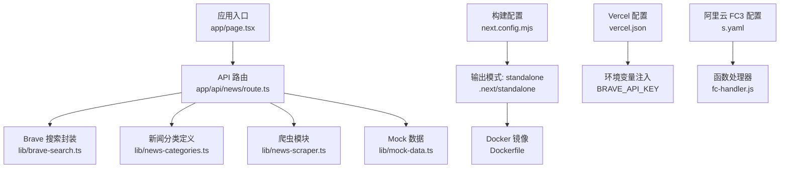
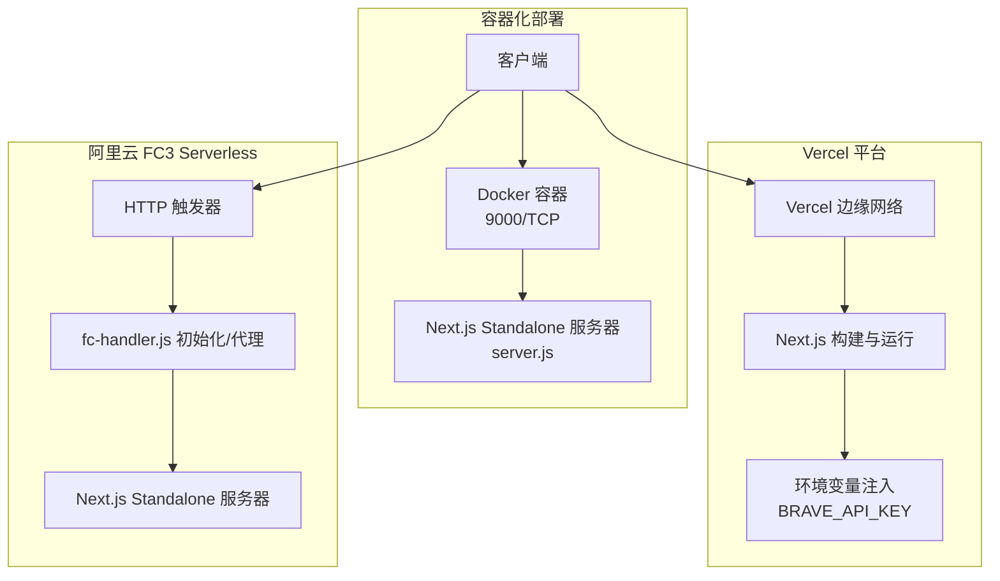
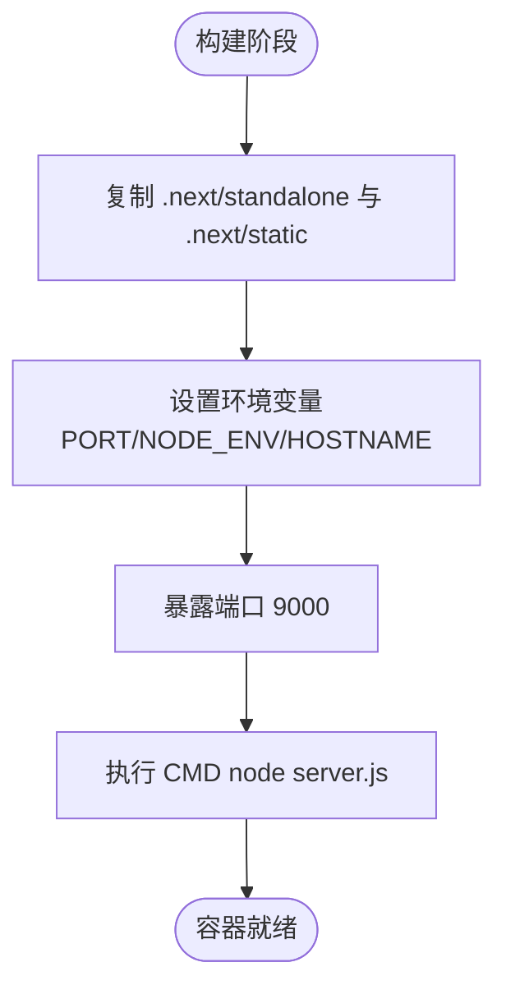
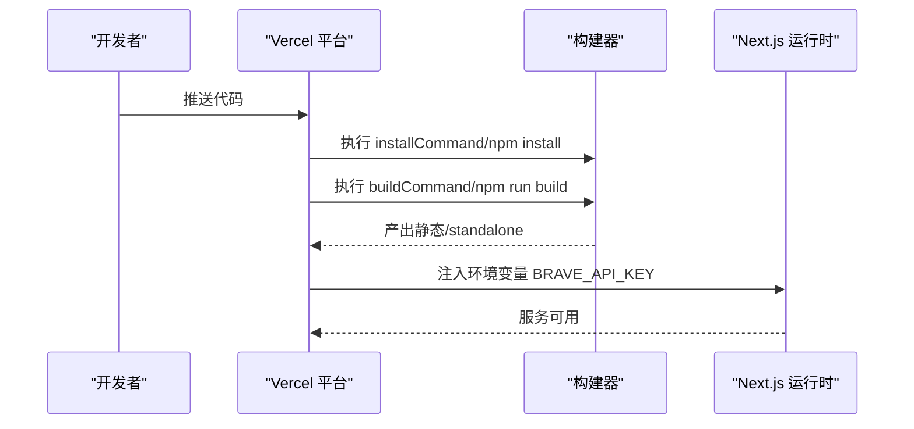
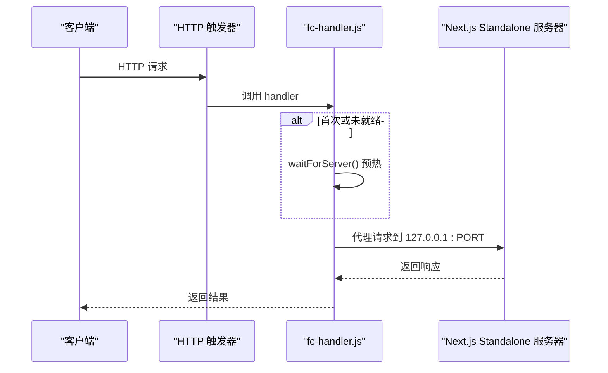
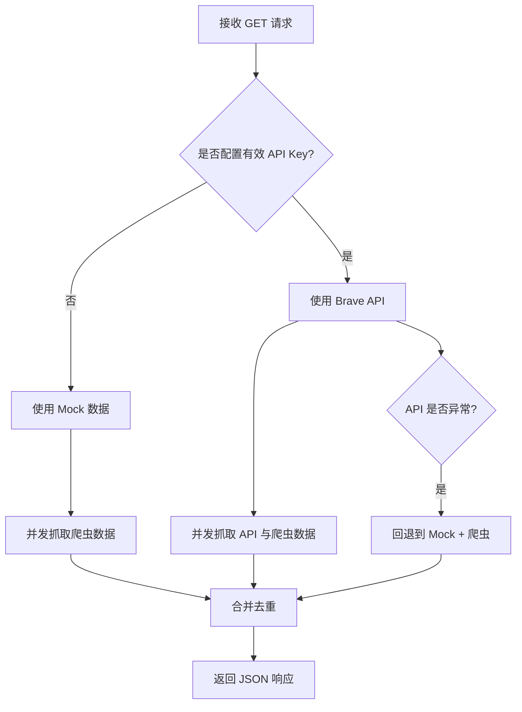
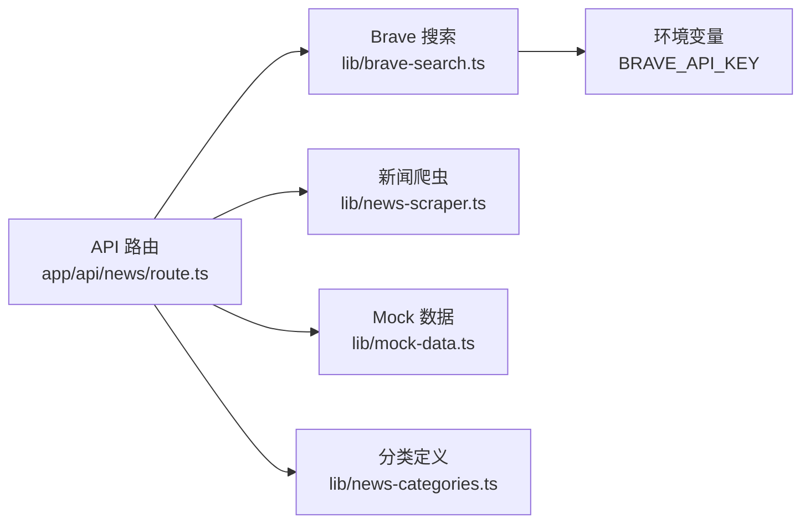

# 部署和运维

<cite>
**本文引用的文件**
- [package.json](file://package.json)
- [Dockerfile](file://Dockerfile)
- [vercel.json](file://vercel.json)
- [s.yaml](file://s.yaml)
- [fc-handler.js](file://fc-handler.js)
- [next.config.mjs](file://next.config.mjs)
- [README.md](file://README.md)
- [启动网站.sh](file://启动网站.sh)
- [app/api/news/route.ts](file://app/api/news/route.ts)
- [lib/brave-search.ts](file://lib/brave-search.ts)
- [lib/news-scraper.ts](file://lib/news-scraper.ts)
- [lib/mock-data.ts](file://lib/mock-data.ts)
- [lib/news-categories.ts](file://lib/news-categories.ts)
</cite>

## 目录
1. [简介](#简介)
2. [项目结构](#项目结构)
3. [核心组件](#核心组件)
4. [架构总览](#架构总览)
5. [详细组件分析](#详细组件分析)
6. [依赖关系分析](#依赖关系分析)
7. [性能考量](#性能考量)
8. [故障排查指南](#故障排查指南)
9. [结论](#结论)
10. [附录](#附录)

## 简介
本文件面向部署与运维工程师，系统化梳理该新闻网站的多种部署与运维实践，包括：
- Docker 容器化部署与镜像运行参数
- Vercel 平台部署配置与环境变量注入
- Serverless 函数（阿里云 FC3）部署与触发器配置
- 环境变量管理与生产优化建议
- 安全加固与 API 密钥保护
- CI/CD 流水线与自动化测试建议
- 监控告警、日志管理与故障恢复策略
- 负载均衡、域名与 SSL 证书管理

## 项目结构
该项目基于 Next.js 16 应用，采用 App Router 结构，核心 API 路由位于 app/api/news/route.ts，数据来源包括 Brave Search API 与本地爬虫，同时提供 Mock 数据回退。

图表来源
- [next.config.mjs](file://next.config.mjs#L1-L9)
- [Dockerfile](file://Dockerfile#L1-L16)
- [vercel.json](file://vercel.json#L1-L11)
- [s.yaml](file://s.yaml#L1-L40)
- [fc-handler.js](file://fc-handler.js#L1-L125)
- [app/api/news/route.ts](file://app/api/news/route.ts#L1-L136)
- [lib/brave-search.ts](file://lib/brave-search.ts#L1-L115)
- [lib/news-scraper.ts](file://lib/news-scraper.ts#L1-L166)
- [lib/mock-data.ts](file://lib/mock-data.ts#L1-L197)
- [lib/news-categories.ts](file://lib/news-categories.ts#L1-L45)

章节来源
- [package.json](file://package.json#L1-L30)
- [next.config.mjs](file://next.config.mjs#L1-L9)
- [README.md](file://README.md#L1-L49)

## 核心组件
- API 路由与数据聚合
  - app/api/news/route.ts 提供统一新闻接口，支持分类查询与关键词搜索；当未配置有效 API Key 时自动回退到 Mock 数据与爬虫数据合并。
- 搜索与抓取
  - lib/brave-search.ts 封装 Brave Search API，失败时回退到网页搜索；lib/news-scraper.ts 对 Hacker News 等站点进行分类抓取。
- 构建与运行
  - next.config.mjs 输出为 standalone，便于容器或 Serverless 场景直接运行；Dockerfile 基于 node:18-alpine，暴露 9000 端口并以 node server.js 启动。
- 平台部署
  - vercel.json 定义框架为 Next.js，通过环境变量注入 BRAVE_API_KEY；s.yaml 定义阿里云 FC3 函数，使用 .next/standalone 作为代码目录，绑定 HTTP 触发器与自定义域名路由。

章节来源
- [app/api/news/route.ts](file://app/api/news/route.ts#L1-L136)
- [lib/brave-search.ts](file://lib/brave-search.ts#L1-L115)
- [lib/news-scraper.ts](file://lib/news-scraper.ts#L1-L166)
- [next.config.mjs](file://next.config.mjs#L1-L9)
- [Dockerfile](file://Dockerfile#L1-L16)
- [vercel.json](file://vercel.json#L1-L11)
- [s.yaml](file://s.yaml#L1-L40)

## 架构总览
下图展示三种部署形态的请求处理链路与关键配置点：

图表来源
- [Dockerfile](file://Dockerfile#L1-L16)
- [vercel.json](file://vercel.json#L1-L11)
- [s.yaml](file://s.yaml#L1-L40)
- [fc-handler.js](file://fc-handler.js#L1-L125)
- [next.config.mjs](file://next.config.mjs#L1-L9)

## 详细组件分析

### Docker 容器化部署
- 构建产物
  - 使用 output: 'standalone'，构建产物包含可独立运行的 server.js 与静态资源，适合容器直接运行。
- 运行参数
  - 默认监听 0.0.0.0:9000，生产环境建议通过环境变量覆盖 PORT、HOSTNAME。
- 建议
  - 在生产中固定镜像版本（如 node:18.20.5-alpine），启用只读根文件系统与最小权限用户，结合健康检查与资源限制。

图表来源
- [Dockerfile](file://Dockerfile#L1-L16)
- [next.config.mjs](file://next.config.mjs#L1-L9)

章节来源
- [Dockerfile](file://Dockerfile#L1-L16)
- [next.config.mjs](file://next.config.mjs#L1-L9)

### Vercel 平台部署
- 配置要点
  - framework: nextjs，buildCommand/devCommand/installCommand 明确构建与开发命令。
  - 通过 vercel.json 的 env 字段注入 BRAVE_API_KEY，避免硬编码。
- 建议
  - 使用 Vercel 环境变量管理敏感信息；开启边缘缓存与压缩；按需启用 ISR 或静态导出以提升性能。

图表来源
- [vercel.json](file://vercel.json#L1-L11)
- [package.json](file://package.json#L1-L30)

章节来源
- [vercel.json](file://vercel.json#L1-L11)
- [package.json](file://package.json#L1-L30)

### 阿里云 FC3 Serverless 函数
- 配置要点
  - 组件: fc3，runtime: nodejs18，CPU/内存/磁盘/超时按业务峰值设定。
  - environmentVariables 中注入 BRAVE_API_KEY。
  - 触发器: httpTrigger，methods 支持 GET/POST/PUT/DELETE，匿名认证。
  - customDomains: 自定义域名路由到路径 /*。
- 运行机制
  - fc-handler.js 在 initializer 中预热 Next.js standalone 服务器，handler 将请求代理到本地 server.js，内置超时与错误处理。
- 建议
  - 为函数设置冷启动优化（initializer 预热）、连接池与超时阈值；结合 SLB 或 CDN 做流量削峰与就近访问。

图表来源
- [s.yaml](file://s.yaml#L1-L40)
- [fc-handler.js](file://fc-handler.js#L1-L125)

章节来源
- [s.yaml](file://s.yaml#L1-L40)
- [fc-handler.js](file://fc-handler.js#L1-L125)

### API 路由与数据聚合逻辑
- 关键行为
  - 读取 BRAVE_API_KEY，若为空或占位符则回退到 Mock 数据与爬虫数据合并。
  - 支持分类查询与关键词搜索；并发拉取 API 与爬虫数据，合并去重。
  - 异常时回退到 Mock + 爬虫，保证服务可用性。
- 性能与可靠性
  - 使用 Promise.all 并发获取数据；合并时以标题去重，优先保留 API 来源。

图表来源
- [app/api/news/route.ts](file://app/api/news/route.ts#L1-L136)
- [lib/brave-search.ts](file://lib/brave-search.ts#L1-L115)
- [lib/news-scraper.ts](file://lib/news-scraper.ts#L1-L166)
- [lib/mock-data.ts](file://lib/mock-data.ts#L1-L197)

章节来源
- [app/api/news/route.ts](file://app/api/news/route.ts#L1-L136)
- [lib/brave-search.ts](file://lib/brave-search.ts#L1-L115)
- [lib/news-scraper.ts](file://lib/news-scraper.ts#L1-L166)
- [lib/mock-data.ts](file://lib/mock-data.ts#L1-L197)

### 环境变量与安全加固
- 必要环境变量
  - BRAVE_API_KEY：Brave Search API 订阅密钥。
- 生产建议
  - 使用平台提供的密钥管理（Vercel 环境变量、阿里云密钥管理服务），避免明文提交到仓库。
  - 限制 API Key 权限范围与配额，启用速率限制与审计日志。
  - 在容器与函数中仅暴露必要环境变量，避免泄露。

章节来源
- [vercel.json](file://vercel.json#L7-L9)
- [s.yaml](file://s.yaml#L21-L22)
- [app/api/news/route.ts](file://app/api/news/route.ts#L7-L11)
- [lib/brave-search.ts](file://lib/brave-search.ts#L27-L28)

### CI/CD 流水线与自动化测试
- 构建与测试
  - 使用 npm run build 与 npm run lint；建议在流水线中加入单元测试与端到端测试步骤。
- 发布策略
  - 分支保护 + PR 审查；容器镜像打标签（语义化版本）；Serverless 与平台部署采用蓝绿/金丝雀发布。
- 日志与监控
  - 容器与函数输出统一采集到日志平台；关键指标（P95 延迟、错误率、API 调用次数）接入监控告警。

章节来源
- [package.json](file://package.json#L5-L9)
- [README.md](file://README.md#L5-L9)

### 监控告警、日志与故障恢复
- 监控指标
  - API 延迟与吞吐、Brave Search 调用成功率、容器/函数 CPU/内存使用率、错误码分布。
- 日志管理
  - 统一收集 stdout/stderr，结构化日志字段（请求 ID、分类、关键词、来源统计）。
- 故障恢复
  - 失败回退策略已内置（Mock + 爬虫）；建议配合熔断与重试，超时与降级阈值根据 SLA 设定。

章节来源
- [app/api/news/route.ts](file://app/api/news/route.ts#L112-L134)

### 负载均衡、域名与 SSL
- 负载均衡
  - 容器化：使用反向代理或平台 LB；Serverless：利用平台边缘网络就近分发。
- 域名与 SSL
  - Vercel：平台自动签发与续期；阿里云：通过自定义域名与证书管理服务配置 HTTPS。
- 建议
  - 开启 HSTS 与安全响应头；启用 HTTP/2 或 HTTP/3；对静态资源使用 CDN 加速。

章节来源
- [vercel.json](file://vercel.json#L1-L11)
- [s.yaml](file://s.yaml#L35-L39)

## 依赖关系分析
- 组件耦合
  - API 路由依赖搜索与爬虫模块；搜索模块依赖环境变量；爬虫模块依赖第三方站点；Mock 数据用于降级。
- 外部依赖
  - Brave Search API；Hacker News 等公开站点；Next.js 运行时与 Node.js 环境。
- 循环依赖
  - 当前模块间无循环导入；各模块职责清晰，利于测试与替换。

图表来源
- [app/api/news/route.ts](file://app/api/news/route.ts#L1-L136)
- [lib/brave-search.ts](file://lib/brave-search.ts#L1-L115)
- [lib/news-scraper.ts](file://lib/news-scraper.ts#L1-L166)
- [lib/mock-data.ts](file://lib/mock-data.ts#L1-L197)
- [lib/news-categories.ts](file://lib/news-categories.ts#L1-L45)

章节来源
- [app/api/news/route.ts](file://app/api/news/route.ts#L1-L136)
- [lib/brave-search.ts](file://lib/brave-search.ts#L1-L115)
- [lib/news-scraper.ts](file://lib/news-scraper.ts#L1-L166)
- [lib/mock-data.ts](file://lib/mock-data.ts#L1-L197)
- [lib/news-categories.ts](file://lib/news-categories.ts#L1-L45)

## 性能考量
- 构建与运行
  - 使用 standalone 输出减少运行时依赖；容器与函数中避免不必要的文件拷贝。
- 并发与缓存
  - API 与爬虫并发拉取；合理设置超时与重试；对热点内容进行缓存（平台缓存或外部缓存）。
- 资源与伸缩
  - 容器与函数按峰值配置 CPU/内存；启用自动扩缩容与健康检查；对 IO 密集型爬虫设置连接池。

## 故障排查指南
- 常见问题定位
  - API Key 未配置或无效：检查环境变量注入与占位符判断逻辑。
  - Brave API 失败：查看回退到网页搜索的逻辑与错误日志。
  - 爬虫失败：检查目标站点可访问性与解析规则。
- 诊断步骤
  - 查看容器/函数日志；验证环境变量；模拟请求路径；核对分类与关键词映射。
- 回退策略
  - 保持 Mock + 爬虫回退路径可用，确保服务连续性。

章节来源
- [app/api/news/route.ts](file://app/api/news/route.ts#L48-L74)
- [lib/brave-search.ts](file://lib/brave-search.ts#L55-L58)
- [lib/news-scraper.ts](file://lib/news-scraper.ts#L132-L135)

## 结论
本项目提供了三种成熟可靠的部署形态：容器化、平台托管与 Serverless 函数。通过 standalone 构建、环境变量注入与内置回退机制，可在不同环境下实现稳定运行。建议在生产中强化密钥管理、监控告警与自动化发布流程，并结合负载均衡与 CDN 提升可用性与性能。

## 附录
- 快速启动
  - 本地开发：参考 README 的启动命令与访问地址。
  - 容器运行：基于 Dockerfile 构建镜像，设置环境变量后运行。
  - 平台部署：在 Vercel 中关联仓库并配置环境变量；或在阿里云中部署 FC3 函数。
- 参考命令
  - 构建：npm run build
  - 启动：npm run start
  - 开发：npm run dev

章节来源
- [README.md](file://README.md#L5-L11)
- [启动网站.sh](file://启动网站.sh#L1-L9)
- [package.json](file://package.json#L5-L9)