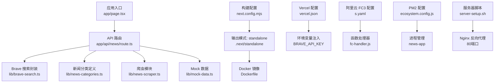
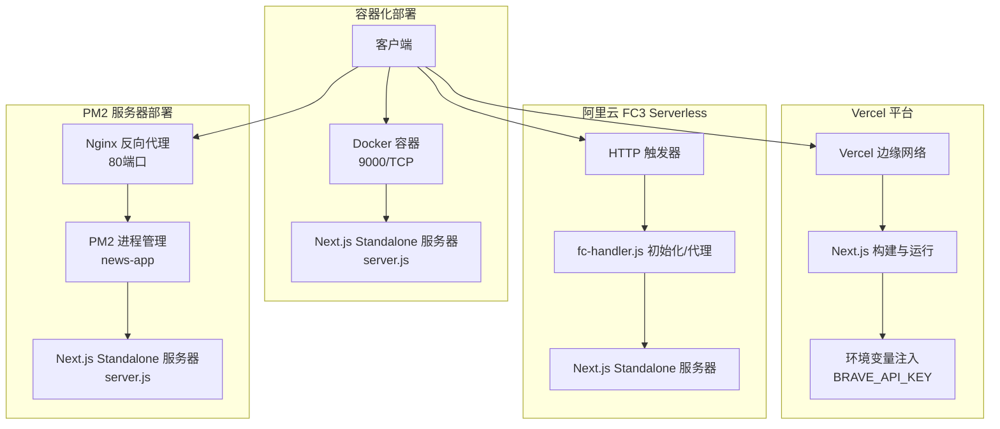
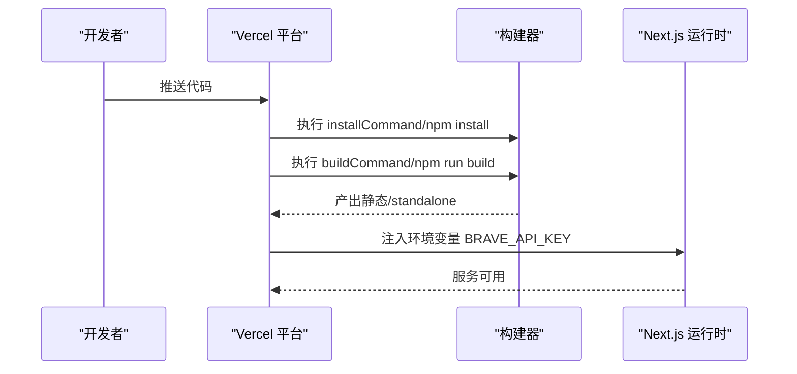
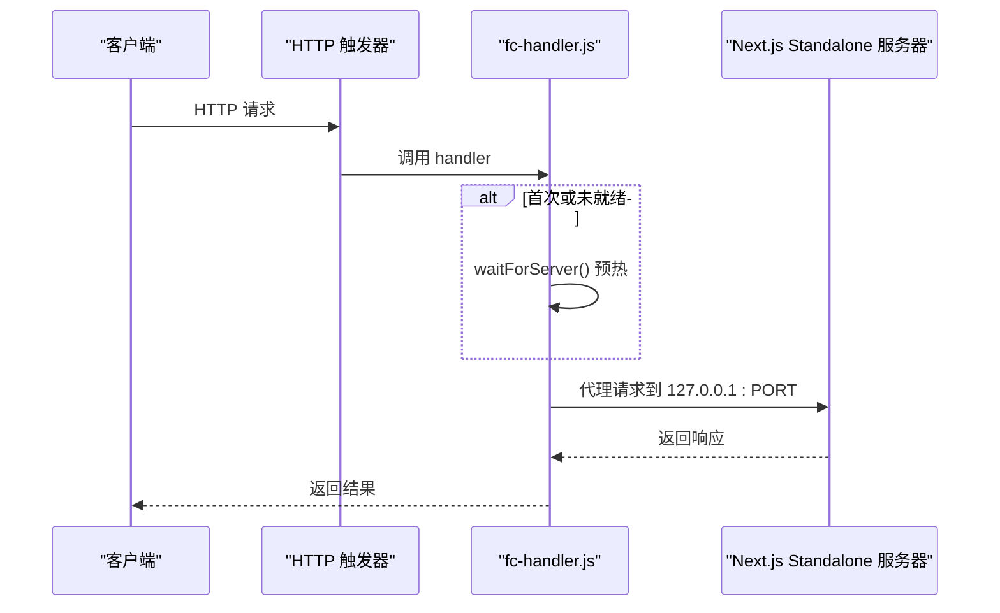
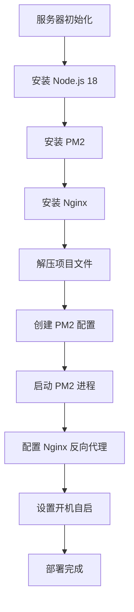
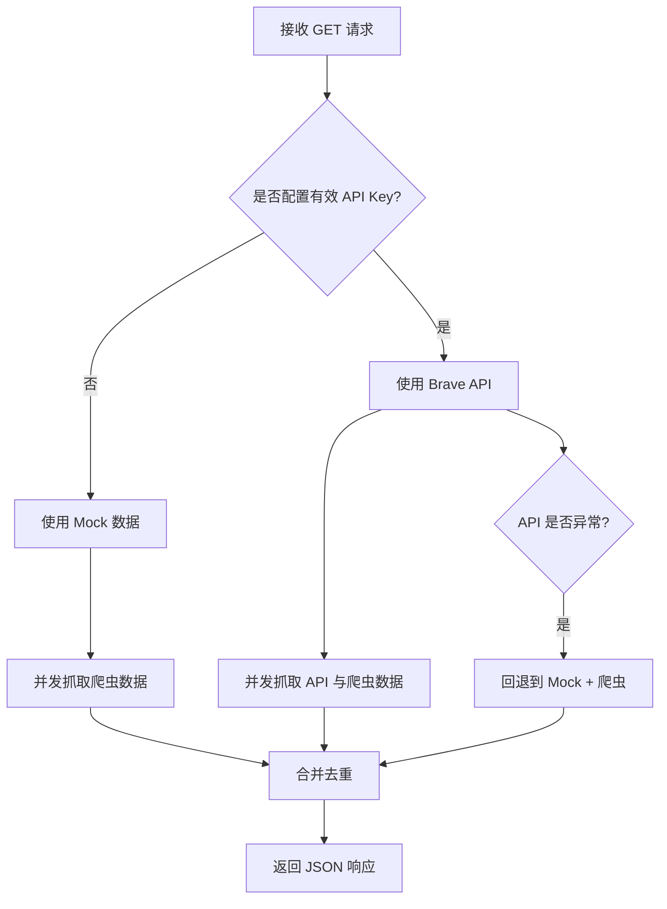
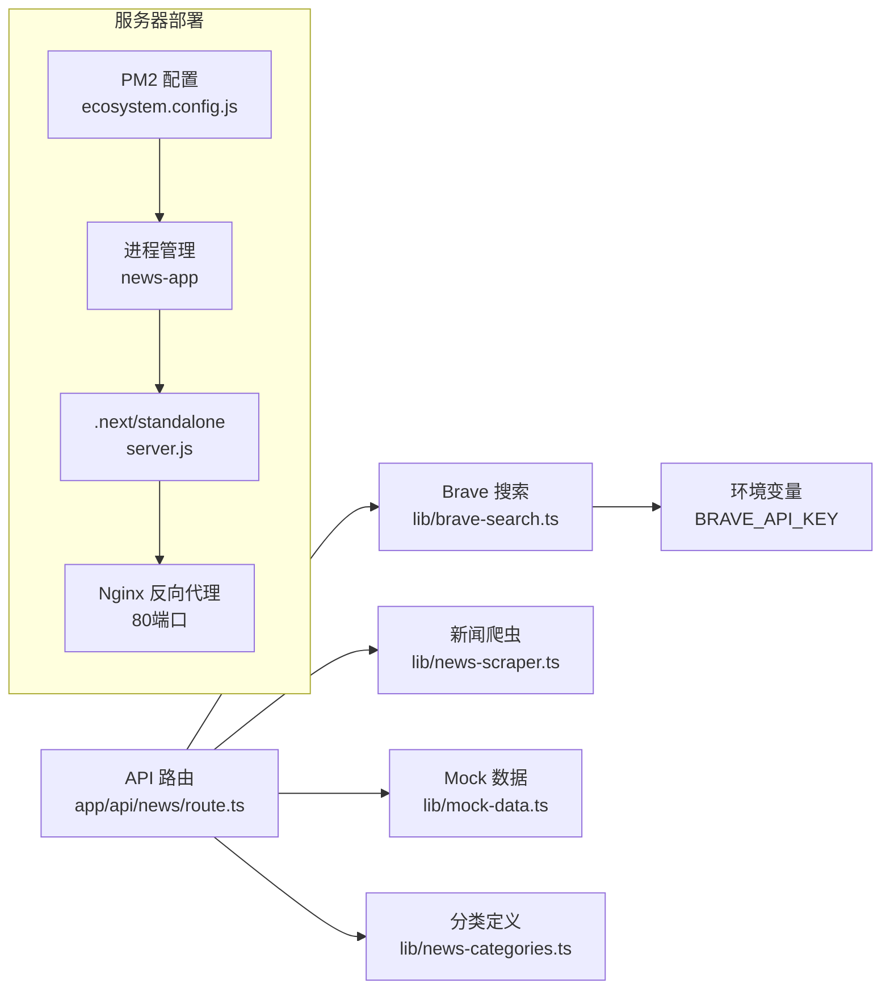

# 部署和运维

<cite>
**本文引用的文件**
- [package.json](file://package.json)
- [Dockerfile](file://Dockerfile)
- [vercel.json](file://vercel.json)
- [s.yaml](file://s.yaml)
- [fc-handler.js](file://fc-handler.js)
- [next.config.mjs](file://next.config.mjs)
- [README.md](file://README.md)
- [启动网站.sh](file://启动网站.sh)
- [ecosystem.config.js](file://ecosystem.config.js)
- [deploy.sh](file://deploy.sh)
- [server-setup.sh](file://server-setup.sh)
- [app/api/news/route.ts](file://app/api/news/route.ts)
- [lib/brave-search.ts](file://lib/brave-search.ts)
- [lib/news-scraper.ts](file://lib/news-scraper.ts)
- [lib/mock-data.ts](file://lib/mock-data.ts)
- [lib/news-categories.ts](file://lib/news-categories.ts)
</cite>

## 更新摘要
**变更内容**
- 新增PM2进程管理配置和部署流程
- 更新服务器初始化脚本，集成Nginx反向代理
- 简化部署脚本，支持standalone目录热更新
- 更新生产环境配置，支持多环境部署模式

## 目录
1. [简介](#简介)
2. [项目结构](#项目结构)
3. [核心组件](#核心组件)
4. [架构总览](#架构总览)
5. [详细组件分析](#详细组件分析)
6. [依赖关系分析](#依赖关系分析)
7. [性能考量](#性能考量)
8. [故障排查指南](#故障排查指南)
9. [结论](#结论)
10. [附录](#附录)

## 简介
本文件面向部署与运维工程师，系统化梳理该新闻网站的多种部署与运维实践，包括：
- Docker 容器化部署与镜像运行参数
- Vercel 平台部署配置与环境变量注入
- Serverless 函数（阿里云 FC3）部署与触发器配置
- **PM2 进程管理与服务器部署**
- **Nginx 反向代理与负载均衡**
- 环境变量管理与生产优化建议
- 安全加固与 API 密钥保护
- CI/CD 流水线与自动化测试建议
- 监控告警、日志管理与故障恢复策略
- 负载均衡、域名与 SSL 证书管理

## 项目结构
该项目基于 Next.js 16 应用，采用 App Router 结构，核心 API 路由位于 app/api/news/route.ts，数据来源包括 Brave Search API 与本地爬虫，同时提供 Mock 数据回退。

**图表来源**
- [next.config.mjs](file://next.config.mjs#L1-L11)
- [Dockerfile](file://Dockerfile#L1-L16)
- [vercel.json](file://vercel.json#L1-L11)
- [s.yaml](file://s.yaml#L1-L38)
- [fc-handler.js](file://fc-handler.js#L1-L114)
- [app/api/news/route.ts](file://app/api/news/route.ts#L1-L136)
- [lib/brave-search.ts](file://lib/brave-search.ts#L1-L115)
- [lib/news-scraper.ts](file://lib/news-scraper.ts#L1-L166)
- [lib/mock-data.ts](file://lib/mock-data.ts#L1-L197)
- [lib/news-categories.ts](file://lib/news-categories.ts#L1-L45)
- [ecosystem.config.js](file://ecosystem.config.js#L1-L16)
- [server-setup.sh](file://server-setup.sh#L1-L140)

**章节来源**
- [package.json](file://package.json#L1-L30)
- [next.config.mjs](file://next.config.mjs#L1-L11)
- [README.md](file://README.md#L1-L49)

## 核心组件
- API 路由与数据聚合
  - app/api/news/route.ts 提供统一新闻接口，支持分类查询与关键词搜索；当未配置有效 API Key 时自动回退到 Mock 数据与爬虫数据合并。
- 搜索与抓取
  - lib/brave-search.ts 封装 Brave Search API，失败时回退到网页搜索；lib/news-scraper.ts 对 Hacker News 等站点进行分类抓取。
- 构建与运行
  - next.config.mjs 输出为 standalone，便于容器或 Serverless 场景直接运行；Dockerfile 基于 node:18-alpine，暴露 9000 端口并以 node server.js 启动。
- 平台部署
  - vercel.json 定义框架为 Next.js，通过环境变量注入 BRAVE_API_KEY；s.yaml 定义阿里云 FC3 函数，使用 .next/standalone 作为代码目录，绑定 HTTP 触发器与自定义域名路由。
- **服务器部署**
  - **ecosystem.config.js** 定义 PM2 进程配置，支持自动重启、内存监控和环境变量管理；**server-setup.sh** 提供完整的服务器初始化脚本，包含 Node.js、PM2、Nginx 安装和配置。
- **部署管理**
  - **deploy.sh** 简化的部署脚本，支持 standalone 目录热更新和 PM2 重启；**启动网站.sh** 提供本地开发启动脚本。

**章节来源**
- [app/api/news/route.ts](file://app/api/news/route.ts#L1-L136)
- [lib/brave-search.ts](file://lib/brave-search.ts#L1-L115)
- [lib/news-scraper.ts](file://lib/news-scraper.ts#L1-L166)
- [next.config.mjs](file://next.config.mjs#L1-L11)
- [Dockerfile](file://Dockerfile#L1-L16)
- [vercel.json](file://vercel.json#L1-L11)
- [s.yaml](file://s.yaml#L1-L38)
- [ecosystem.config.js](file://ecosystem.config.js#L1-L16)
- [deploy.sh](file://deploy.sh#L1-L18)
- [server-setup.sh](file://server-setup.sh#L1-L140)

## 架构总览
下图展示四种部署形态的请求处理链路与关键配置点：

**图表来源**
- [Dockerfile](file://Dockerfile#L1-L16)
- [vercel.json](file://vercel.json#L1-L11)
- [s.yaml](file://s.yaml#L1-L38)
- [fc-handler.js](file://fc-handler.js#L1-L114)
- [next.config.mjs](file://next.config.mjs#L1-L11)
- [ecosystem.config.js](file://ecosystem.config.js#L1-L16)
- [server-setup.sh](file://server-setup.sh#L98-L126)

## 详细组件分析

### Docker 容器化部署
- 构建产物
  - 使用 output: 'standalone'，构建产物包含可独立运行的 server.js 与静态资源，适合容器直接运行。
- 运行参数
  - 默认监听 0.0.0.0:9000，生产环境建议通过环境变量覆盖 PORT、HOSTNAME。
- 建议
  - 在生产中固定镜像版本（如 node:18.20.5-alpine），启用只读根文件系统与最小权限用户，结合健康检查与资源限制。

**图表来源**
- [Dockerfile](file://Dockerfile#L1-L16)
- [next.config.mjs](file://next.config.mjs#L1-L11)

**章节来源**
- [Dockerfile](file://Dockerfile#L1-L16)
- [next.config.mjs](file://next.config.mjs#L1-L11)

### Vercel 平台部署
- 配置要点
  - framework: nextjs，buildCommand/devCommand/installCommand 明确构建与开发命令。
  - 通过 vercel.json 的 env 字段注入 BRAVE_API_KEY，避免硬编码。
- 建议
  - 使用 Vercel 环境变量管理敏感信息；开启边缘缓存与压缩；按需启用 ISR 或静态导出以提升性能。

**图表来源**
- [vercel.json](file://vercel.json#L1-L11)
- [package.json](file://package.json#L1-L30)

**章节来源**
- [vercel.json](file://vercel.json#L1-L11)
- [package.json](file://package.json#L1-L30)

### 阿里云 FC3 Serverless 函数
- 配置要点
  - 组件: fc3，runtime: nodejs18，CPU/内存/磁盘/超时按业务峰值设定。
  - environmentVariables 中注入 BRAVE_API_KEY。
  - 触发器: httpTrigger，methods 支持 GET/POST/PUT/DELETE，匿名认证。
  - customDomains: 自定义域名路由到路径 /*。
- 运行机制
  - fc-handler.js 在 initializer 中预热 Next.js standalone 服务器，handler 将请求代理到本地 server.js，内置超时与错误处理。
- 建议
  - 为函数设置冷启动优化（initializer 预热）、连接池与超时阈值；结合 SLB 或 CDN 做流量削峰与就近访问。

**图表来源**
- [s.yaml](file://s.yaml#L1-L38)
- [fc-handler.js](file://fc-handler.js#L1-L114)

**章节来源**
- [s.yaml](file://s.yaml#L1-L38)
- [fc-handler.js](file://fc-handler.js#L1-L114)

### PM2 服务器部署
- **配置要点**
  - **进程管理**：使用 ecosystem.config.js 定义 news-app 进程，支持自动重启、内存监控（1G限制）。
  - **环境变量**：NODE_ENV=production，PORT=3000，HOSTNAME=0.0.0.0，BRAVE_API_KEY 等。
  - **部署流程**：通过 deploy.sh 脚本实现 standalone 目录热更新和 PM2 重启。
- **服务器初始化**
  - **server-setup.sh** 提供完整的服务器环境搭建，包含 Node.js 18、PM2、Nginx 安装与配置。
  - **Nginx 反向代理**：将 80 端口流量转发到 PM2 管理的 3000 端口。
  - **开机自启**：配置 PM2 startup systemd，确保服务器重启后自动启动应用。
- **部署优势**
  - **热更新**：无需重建镜像，直接更新 standalone 目录即可实现部署。
  - **进程监控**：PM2 提供进程监控、自动重启和日志管理。
  - **负载均衡**：支持多实例部署，结合 Nginx 实现负载均衡。

**图表来源**
- [server-setup.sh](file://server-setup.sh#L1-L140)
- [ecosystem.config.js](file://ecosystem.config.js#L1-L16)
- [deploy.sh](file://deploy.sh#L1-L18)

**章节来源**
- [ecosystem.config.js](file://ecosystem.config.js#L1-L16)
- [deploy.sh](file://deploy.sh#L1-L18)
- [server-setup.sh](file://server-setup.sh#L1-L140)

### API 路由与数据聚合逻辑
- 关键行为
  - 读取 BRAVE_API_KEY，若为空或占位符则回退到 Mock 数据与爬虫数据合并。
  - 支持分类查询与关键词搜索；并发拉取 API 与爬虫数据，合并去重。
  - 异常时回退到 Mock + 爬虫，保证服务可用性。
- 性能与可靠性
  - 使用 Promise.all 并发获取数据；合并时以标题去重，优先保留 API 来源。

**图表来源**
- [app/api/news/route.ts](file://app/api/news/route.ts#L1-L136)
- [lib/brave-search.ts](file://lib/brave-search.ts#L1-L115)
- [lib/news-scraper.ts](file://lib/news-scraper.ts#L1-L166)
- [lib/mock-data.ts](file://lib/mock-data.ts#L1-L197)

**章节来源**
- [app/api/news/route.ts](file://app/api/news/route.ts#L1-L136)
- [lib/brave-search.ts](file://lib/brave-search.ts#L1-L115)
- [lib/news-scraper.ts](file://lib/news-scraper.ts#L1-L166)
- [lib/mock-data.ts](file://lib/mock-data.ts#L1-L197)

### 环境变量与安全加固
- 必要环境变量
  - BRAVE_API_KEY：Brave Search API 订阅密钥。
  - **JUHE_API_KEY**：聚合数据 API 密钥（PM2 配置中包含示例）。
- 生产建议
  - 使用平台提供的密钥管理（Vercel 环境变量、阿里云密钥管理服务），避免明文提交到仓库。
  - 限制 API Key 权限范围与配额，启用速率限制与审计日志。
  - 在容器与函数中仅暴露必要环境变量，避免泄露。
  - **服务器部署**：通过 PM2 配置文件管理敏感信息，结合 Nginx 反向代理隐藏内部端口。

**章节来源**
- [vercel.json](file://vercel.json#L7-L9)
- [s.yaml](file://s.yaml#L19-L20)
- [app/api/news/route.ts](file://app/api/news/route.ts#L7-L11)
- [lib/brave-search.ts](file://lib/brave-search.ts#L27-L28)
- [ecosystem.config.js](file://ecosystem.config.js#L12-L12)

### CI/CD 流水线与自动化测试
- 构建与测试
  - 使用 npm run build 与 npm run lint；建议在流水线中加入单元测试与端到端测试步骤。
- 发布策略
  - 分支保护 + PR 审查；容器镜像打标签（语义化版本）；Serverless 与平台部署采用蓝绿/金丝雀发布。
  - **服务器部署**：通过 deploy.sh 脚本实现自动化部署，支持 standalone 目录热更新。
- 日志与监控
  - 容器与函数输出统一采集到日志平台；关键指标（P95 延迟、错误率、API 调用次数）接入监控告警。
  - **PM2 日志**：使用 pm2 logs news-app 查看应用日志，结合 Nginx 访问日志分析流量。

**章节来源**
- [package.json](file://package.json#L5-L9)
- [README.md](file://README.md#L5-L9)
- [deploy.sh](file://deploy.sh#L1-L18)

### 监控告警、日志与故障恢复
- 监控指标
  - API 延迟与吞吐、Brave Search 调用成功率、容器/函数 CPU/内存使用率、错误码分布。
  - **服务器监控**：PM2 进程状态、内存使用率、Nginx 连接数、应用响应时间。
- 日志管理
  - 统一收集 stdout/stderr，结构化日志字段（请求 ID、分类、关键词、来源统计）。
  - **PM2 日志**：pm2 logs news-app 查看应用日志；pm2 status 查看进程状态。
- 故障恢复
  - 失败回退策略已内置（Mock + 爬虫）；建议配合熔断与重试，超时与降级阈值根据 SLA 设定。
  - **服务器恢复**：PM2 自动重启机制，Nginx 反向代理故障转移。

**章节来源**
- [app/api/news/route.ts](file://app/api/news/route.ts#L112-L134)
- [ecosystem.config.js](file://ecosystem.config.js#L6-L8)
- [server-setup.sh](file://server-setup.sh#L134-L138)

### 负载均衡、域名与 SSL
- 负载均衡
  - 容器化：使用反向代理或平台 LB；Serverless：利用平台边缘网络就近分发。
  - **服务器部署**：Nginx 反向代理实现负载均衡，支持多实例部署。
- 域名与 SSL
  - Vercel：平台自动签发与续期；阿里云：通过自定义域名与证书管理服务配置 HTTPS。
  - **服务器部署**：Nginx 配置支持 HTTP/HTTPS，可通过 Let's Encrypt 获取免费证书。
- 建议
  - 开启 HSTS 与安全响应头；启用 HTTP/2 或 HTTP/3；对静态资源使用 CDN 加速。

**章节来源**
- [vercel.json](file://vercel.json#L1-L11)
- [s.yaml](file://s.yaml#L33-L38)
- [server-setup.sh](file://server-setup.sh#L98-L126)

## 依赖关系分析
- 组件耦合
  - API 路由依赖搜索与爬虫模块；搜索模块依赖环境变量；爬虫模块依赖第三方站点；Mock 数据用于降级。
  - **PM2 部署**：ecosystem.config.js 依赖 .next/standalone 目录结构；deploy.sh 依赖 PM2 进程管理。
- 外部依赖
  - Brave Search API；Hacker News 等公开站点；Next.js 运行时与 Node.js 环境。
  - **服务器部署**：Node.js 18、PM2、Nginx、Ubuntu 22.04 系统环境。
- 循环依赖
  - 当前模块间无循环导入；各模块职责清晰，利于测试与替换。

**图表来源**
- [app/api/news/route.ts](file://app/api/news/route.ts#L1-L136)
- [lib/brave-search.ts](file://lib/brave-search.ts#L1-L115)
- [lib/news-scraper.ts](file://lib/news-scraper.ts#L1-L166)
- [lib/mock-data.ts](file://lib/mock-data.ts#L1-L197)
- [lib/news-categories.ts](file://lib/news-categories.ts#L1-L45)
- [ecosystem.config.js](file://ecosystem.config.js#L1-L16)
- [server-setup.sh](file://server-setup.sh#L98-L126)

**章节来源**
- [app/api/news/route.ts](file://app/api/news/route.ts#L1-L136)
- [lib/brave-search.ts](file://lib/brave-search.ts#L1-L115)
- [lib/news-scraper.ts](file://lib/news-scraper.ts#L1-L166)
- [lib/mock-data.ts](file://lib/mock-data.ts#L1-L197)
- [lib/news-categories.ts](file://lib/news-categories.ts#L1-L45)
- [ecosystem.config.js](file://ecosystem.config.js#L1-L16)

## 性能考量
- 构建与运行
  - 使用 standalone 输出减少运行时依赖；容器与函数中避免不必要的文件拷贝。
  - **服务器部署**：PM2 进程管理提供更好的资源利用率和进程隔离。
- 并发与缓存
  - API 与爬虫并发拉取；合理设置超时与重试；对热点内容进行缓存（平台缓存或外部缓存）。
  - **Nginx 缓存**：配置静态资源缓存和反向代理缓存策略。
- 资源与伸缩
  - 容器与函数按峰值配置 CPU/内存；启用自动扩缩容与健康检查；对 IO 密集型爬虫设置连接池。
  - **服务器部署**：PM2 支持多实例部署，结合 Nginx 实现水平扩展。

## 故障排查指南
- 常见问题定位
  - API Key 未配置或无效：检查环境变量注入与占位符判断逻辑。
  - Brave API 失败：查看回退到网页搜索的逻辑与错误日志。
  - 爬虫失败：检查目标站点可访问性与解析规则。
  - **PM2 部署**：检查进程状态（pm2 status）、日志（pm2 logs news-app）、内存使用情况。
  - **Nginx 问题**：检查配置文件语法（nginx -t）、服务状态、访问日志。
- 诊断步骤
  - 查看容器/函数日志；验证环境变量；模拟请求路径；核对分类与关键词映射。
  - **服务器部署**：检查 PM2 进程状态、Nginx 配置、防火墙设置。
- 回退策略
  - 保持 Mock + 爬虫回退路径可用，确保服务连续性。
  - **服务器部署**：PM2 自动重启机制，Nginx 故障转移。

**章节来源**
- [app/api/news/route.ts](file://app/api/news/route.ts#L48-L74)
- [lib/brave-search.ts](file://lib/brave-search.ts#L55-L58)
- [lib/news-scraper.ts](file://lib/news-scraper.ts#L132-L135)
- [ecosystem.config.js](file://ecosystem.config.js#L6-L8)
- [server-setup.sh](file://server-setup.sh#L134-L138)

## 结论
本项目提供了四种成熟可靠的部署形态：容器化、平台托管、Serverless 函数和 PM2 服务器部署。通过 standalone 构建、环境变量注入与内置回退机制，可在不同环境下实现稳定运行。**新增的 PM2 配置和服务器部署脚本**进一步增强了生产环境的稳定性与可维护性，支持热更新、进程监控和负载均衡。建议在生产中强化密钥管理、监控告警与自动化发布流程，并结合负载均衡与 CDN 提升可用性与性能。

## 附录
- 快速启动
  - 本地开发：参考 README 的启动命令与访问地址。
  - 容器运行：基于 Dockerfile 构建镜像，设置环境变量后运行。
  - 平台部署：在 Vercel 中关联仓库并配置环境变量；或在阿里云中部署 FC3 函数。
  - **服务器部署**：执行 server-setup.sh 完成环境初始化，然后通过 PM2 管理应用。
- 参考命令
  - 构建：npm run build
  - 启动：npm run start
  - 开发：npm run dev
  - **PM2 管理**：pm2 start ecosystem.config.js，pm2 status，pm2 logs news-app
  - **服务器部署**：bash server-setup.sh，bash deploy.sh

**章节来源**
- [README.md](file://README.md#L5-L11)
- [启动网站.sh](file://启动网站.sh#L1-L9)
- [package.json](file://package.json#L5-L9)
- [ecosystem.config.js](file://ecosystem.config.js#L1-L16)
- [server-setup.sh](file://server-setup.sh#L1-L140)
- [deploy.sh](file://deploy.sh#L1-L18)