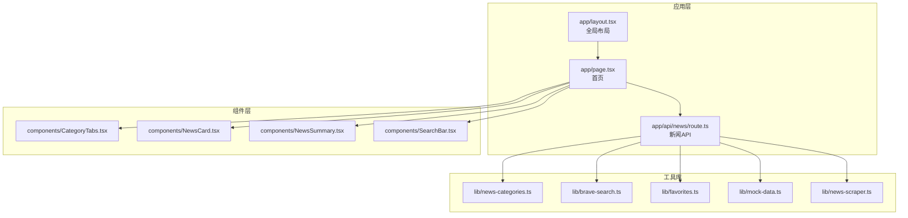
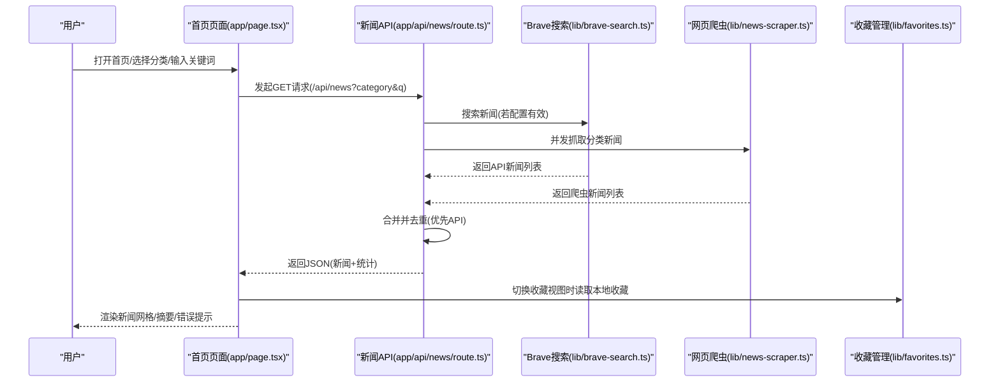
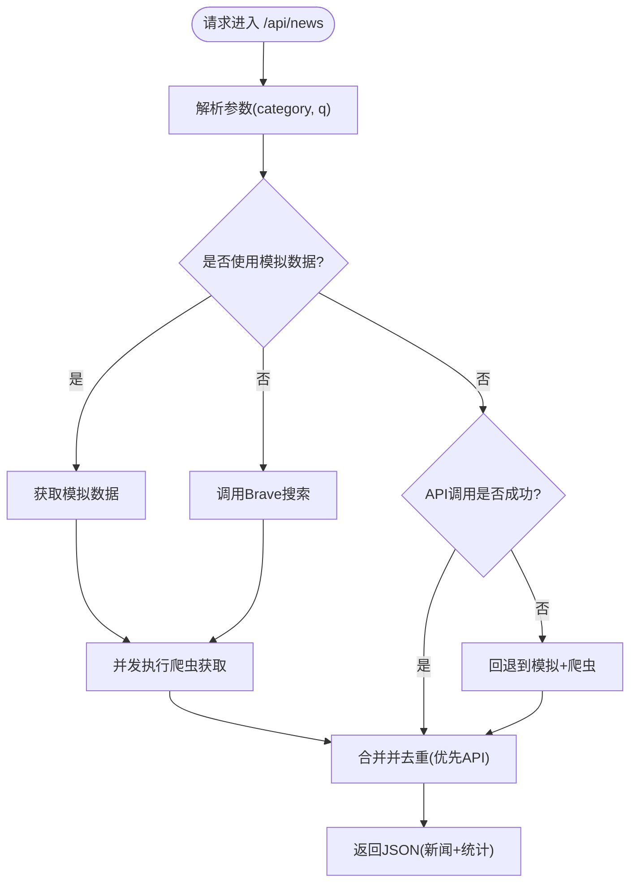
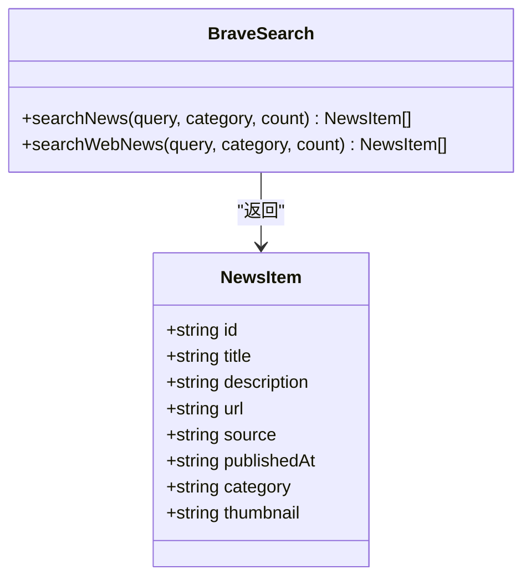
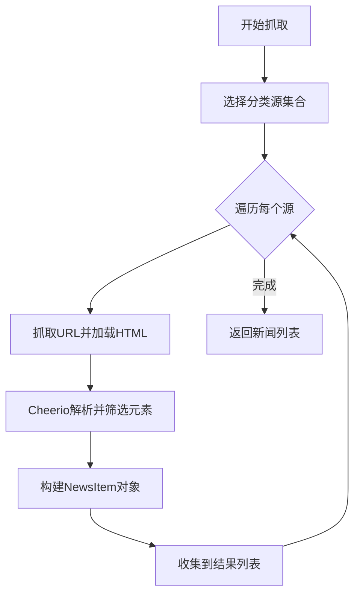
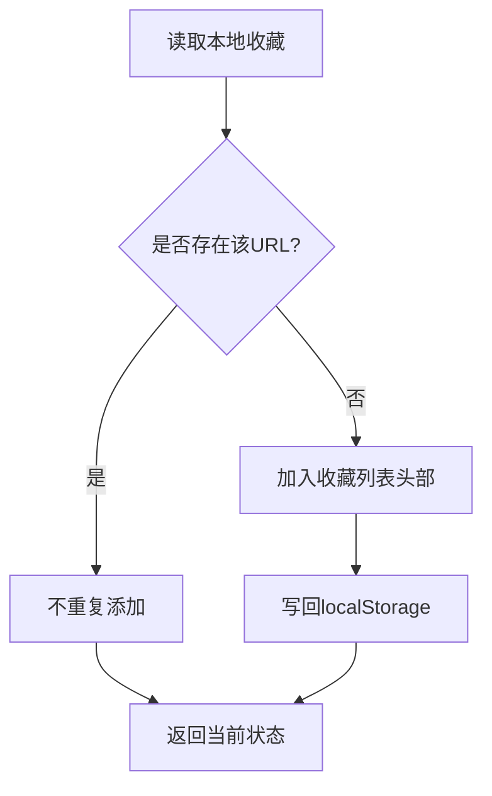
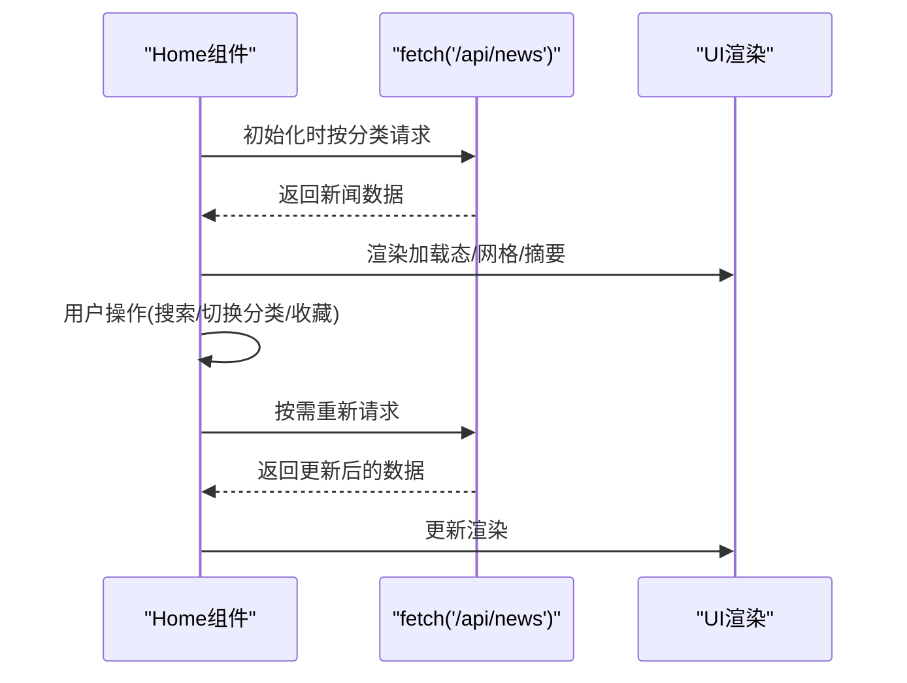
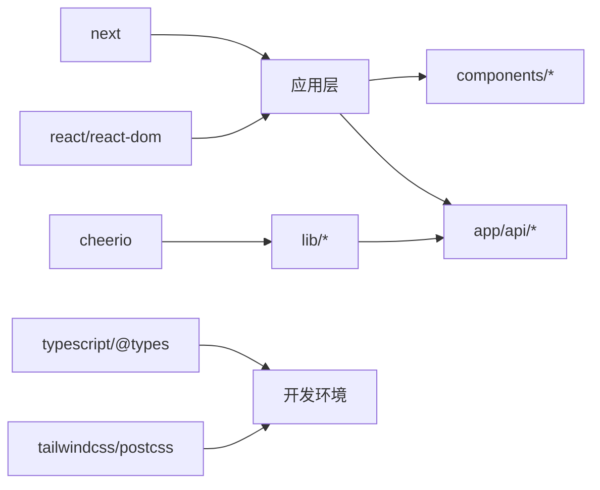

# 项目概述

<cite>
**本文档引用的文件**
- [README.md](file://README.md)
- [package.json](file://package.json)
- [app/layout.tsx](file://app/layout.tsx)
- [app/page.tsx](file://app/page.tsx)
- [app/api/news/route.ts](file://app/api/news/route.ts)
- [lib/brave-search.ts](file://lib/brave-search.ts)
- [lib/favorites.ts](file://lib/favorites.ts)
- [lib/news-categories.ts](file://lib/news-categories.ts)
- [lib/mock-data.ts](file://lib/mock-data.ts)
- [lib/news-scraper.ts](file://lib/news-scraper.ts)
- [components/CategoryTabs.tsx](file://components/CategoryTabs.tsx)
- [components/NewsCard.tsx](file://components/NewsCard.tsx)
- [components/NewsSummary.tsx](file://components/NewsSummary.tsx)
- [components/SearchBar.tsx](file://components/SearchBar.tsx)
- [next.config.mjs](file://next.config.mjs)
</cite>

## 目录
1. [引言](#引言)
2. [项目结构](#项目结构)
3. [核心组件](#核心组件)
4. [架构总览](#架构总览)
5. [详细组件分析](#详细组件分析)
6. [依赖分析](#依赖分析)
7. [性能考量](#性能考量)
8. [故障排除指南](#故障排除指南)
9. [结论](#结论)
10. [附录](#附录)

## 引言
本项目是一个基于 Next.js 的 AI 新闻聚合平台，旨在为用户提供多源新闻数据的实时聚合与智能浏览体验。系统支持分类浏览、今日摘要、关键词搜索以及个性化收藏功能，通过 Brave Search API 获取权威新闻数据，并结合网页爬虫补充内容，实现高覆盖率与多样性的新闻展示。

项目的核心目标是：
- 提供简洁直观的新闻阅读界面，支持多分类浏览与快速检索
- 通过 AI 驱动的关键词匹配与分类策略，提升新闻相关性
- 保障在无 API 密钥或 API 失败时的可用性，通过模拟数据与爬虫数据回退保证服务连续性
- 以本地化收藏机制增强用户粘性与个性化体验

应用场景包括：
- 信息获取：为关注国际时政、财经商业、科技互联网的用户提供一站式新闻入口
- 决策参考：通过“今日摘要”快速把握当日热点，辅助日常决策
- 学习研究：通过分类与关键词搜索，帮助研究人员快速定位特定主题的新闻素材

价值主张：
- 低门槛接入：无需复杂配置即可运行，支持一键启动与本地收藏
- 多源聚合：API 与爬虫双通道，确保内容覆盖面与稳定性
- 个性化体验：收藏与搜索功能满足用户的定制化需求

## 项目结构
项目采用 Next.js App Router 结构，核心目录组织如下：
- app：应用入口与页面路由，包含全局布局、首页与 API 路由
- components：可复用 UI 组件（分类标签、新闻卡片、摘要、搜索框）
- lib：业务逻辑与工具模块（新闻分类、Brave 搜索、收藏管理、模拟数据、爬虫）
- 根目录配置：包管理、构建配置、部署配置与环境变量

图表来源
- [app/layout.tsx](file://app/layout.tsx#L1-L20)
- [app/page.tsx](file://app/page.tsx#L1-L153)
- [app/api/news/route.ts](file://app/api/news/route.ts#L1-L136)
- [components/CategoryTabs.tsx](file://components/CategoryTabs.tsx#L1-L49)
- [components/NewsCard.tsx](file://components/NewsCard.tsx#L1-L89)
- [components/NewsSummary.tsx](file://components/NewsSummary.tsx#L1-L54)
- [components/SearchBar.tsx](file://components/SearchBar.tsx#L1-L37)
- [lib/news-categories.ts](file://lib/news-categories.ts#L1-L45)
- [lib/brave-search.ts](file://lib/brave-search.ts#L1-L115)
- [lib/favorites.ts](file://lib/favorites.ts#L1-L29)
- [lib/mock-data.ts](file://lib/mock-data.ts#L1-L197)
- [lib/news-scraper.ts](file://lib/news-scraper.ts#L1-L166)

章节来源
- [README.md](file://README.md#L36-L48)
- [package.json](file://package.json#L1-L30)
- [next.config.mjs](file://next.config.mjs#L1-L9)

## 核心组件
- 全局布局与元数据：定义站点标题、描述与基础样式注入
- 首页容器：负责状态管理、API 调用、错误处理与渲染
- 新闻 API：统一聚合 Brave 搜索与网页爬虫数据，提供去重与合并逻辑
- 分类与搜索：分类标签切换与关键词搜索联动
- 新闻卡片：展示标题、摘要、来源与收藏按钮
- 今日摘要：展示当日前五条热点新闻
- 收藏管理：基于浏览器本地存储的收藏增删查

章节来源
- [app/layout.tsx](file://app/layout.tsx#L1-L20)
- [app/page.tsx](file://app/page.tsx#L1-L153)
- [app/api/news/route.ts](file://app/api/news/route.ts#L1-L136)
- [components/CategoryTabs.tsx](file://components/CategoryTabs.tsx#L1-L49)
- [components/NewsCard.tsx](file://components/NewsCard.tsx#L1-L89)
- [components/NewsSummary.tsx](file://components/NewsSummary.tsx#L1-L54)
- [components/SearchBar.tsx](file://components/SearchBar.tsx#L1-L37)
- [lib/favorites.ts](file://lib/favorites.ts#L1-L29)

## 架构总览
系统采用前后端同构架构，前端负责 UI 渲染与交互，后端 API 路由负责数据聚合与去重。整体流程如下：

图表来源
- [app/page.tsx](file://app/page.tsx#L19-L63)
- [app/api/news/route.ts](file://app/api/news/route.ts#L39-L135)
- [lib/brave-search.ts](file://lib/brave-search.ts#L30-L73)
- [lib/news-scraper.ts](file://lib/news-scraper.ts#L140-L153)
- [lib/favorites.ts](file://lib/favorites.ts#L7-L11)

## 详细组件分析

### 新闻API（app/api/news/route.ts）
职责与特性：
- 参数解析：支持分类与关键词查询
- 双通道并发：同时发起 Brave 搜索与网页爬虫请求
- 去重合并：以标题标准化为键进行去重，优先保留 API 数据
- 回退策略：当 API 密钥缺失或调用失败时，回退到模拟数据与爬虫数据
- 错误处理：捕获异常并返回可用数据集，保证服务可用性
- 统计输出：返回各数据源数量与时间戳，便于监控与调试

图表来源
- [app/api/news/route.ts](file://app/api/news/route.ts#L39-L135)

章节来源
- [app/api/news/route.ts](file://app/api/news/route.ts#L1-L136)

### Brave搜索（lib/brave-search.ts）
职责与特性：
- 数据结构：统一 NewsItem 接口，包含标题、描述、链接、来源、发布时间等字段
- 请求封装：构造 Brave Search API 查询参数，支持新鲜度与语言过滤
- 回退机制：当新闻搜索接口不可用时自动回退到网页搜索
- 结果映射：将响应结果映射为统一的新闻对象数组

图表来源
- [lib/brave-search.ts](file://lib/brave-search.ts#L1-L115)

章节来源
- [lib/brave-search.ts](file://lib/brave-search.ts#L1-L115)

### 网页爬虫（lib/news-scraper.ts）
职责与特性：
- 配置驱动：针对不同分类配置对应新闻源与选择器
- 解析器：使用 Cheerio 解析 HTML，提取标题与链接并构造 NewsItem
- 并发抓取：按分类并发抓取，提高数据获取效率
- 容错处理：单个源失败不影响整体流程，记录错误日志

图表来源
- [lib/news-scraper.ts](file://lib/news-scraper.ts#L94-L153)

章节来源
- [lib/news-scraper.ts](file://lib/news-scraper.ts#L1-L166)

### 收藏管理（lib/favorites.ts）
职责与特性：
- 本地存储：基于浏览器 localStorage 实现收藏持久化
- 去重插入：避免重复收藏同一链接
- 快速查询：根据 URL 快速判断是否已收藏
- 增删改查：提供完整的收藏生命周期管理

图表来源
- [lib/favorites.ts](file://lib/favorites.ts#L7-L24)

章节来源
- [lib/favorites.ts](file://lib/favorites.ts#L1-L29)

### 首页容器（app/page.tsx）
职责与特性：
- 状态管理：维护新闻列表、加载状态、分类与收藏状态、错误信息
- 生命周期：组件挂载时按当前分类拉取新闻
- 事件处理：分类切换、关键词搜索、收藏视图切换
- 渲染控制：加载态骨架屏、空状态提示、错误提示与新闻网格
- 今日摘要：在非收藏模式下展示当日前五条摘要

图表来源
- [app/page.tsx](file://app/page.tsx#L19-L63)

章节来源
- [app/page.tsx](file://app/page.tsx#L1-L153)

### UI 组件族
- 分类标签（CategoryTabs）：渲染分类按钮与收藏按钮，支持激活态与悬停态
- 搜索框（SearchBar）：表单提交触发关键词搜索
- 新闻卡片（NewsCard）：展示标题、摘要、来源、发布时间与收藏按钮；支持收藏状态同步
- 今日摘要（NewsSummary）：加载态骨架屏与摘要列表渲染

章节来源
- [components/CategoryTabs.tsx](file://components/CategoryTabs.tsx#L1-L49)
- [components/SearchBar.tsx](file://components/SearchBar.tsx#L1-L37)
- [components/NewsCard.tsx](file://components/NewsCard.tsx#L1-L89)
- [components/NewsSummary.tsx](file://components/NewsSummary.tsx#L1-L54)

## 依赖分析
- 运行时依赖
  - next：框架核心，提供 App Router、SSR、静态导出等能力
  - react / react-dom：前端 UI 库
  - cheerio：服务端/客户端 HTML 解析与选择器
- 开发依赖
  - tailwindcss/postcss：样式工具链
  - typescript/@types：类型支持
- 构建与部署
  - next.config.mjs：启用独立输出与禁用图片优化，便于容器化部署

图表来源
- [package.json](file://package.json#L15-L28)
- [next.config.mjs](file://next.config.mjs#L1-L9)

章节来源
- [package.json](file://package.json#L1-L30)
- [next.config.mjs](file://next.config.mjs#L1-L9)

## 性能考量
- 并发请求：API 层对 Brave 搜索与爬虫进行并发调用，缩短首屏等待时间
- 去重策略：以标题标准化为键进行去重，减少重复内容对用户体验的影响
- 回退机制：在 API 不可用时自动回退到模拟数据与爬虫数据，保证服务连续性
- 图片优化：构建配置禁用图片优化，简化部署流程，适合静态托管场景
- 加载态：骨架屏与摘要占位符提升感知性能，改善用户等待体验

## 故障排除指南
常见问题与解决建议：
- API 密钥未配置或无效
  - 现象：返回模拟数据或回退到爬虫数据
  - 处理：在环境变量中设置有效的 Brave API Key
- Brave API 调用失败
  - 现象：日志出现错误，但仍返回可用数据
  - 处理：检查网络连通性与配额限制，必要时启用回退逻辑
- 爬虫抓取失败
  - 现象：部分分类新闻缺失
  - 处理：检查目标站点可访问性与选择器有效性，查看控制台错误日志
- 收藏无法保存
  - 现象：刷新后收藏丢失
  - 处理：确认浏览器允许本地存储，检查 localStorage 是否被清理

章节来源
- [app/api/news/route.ts](file://app/api/news/route.ts#L48-L74)
- [lib/brave-search.ts](file://lib/brave-search.ts#L35-L58)
- [lib/news-scraper.ts](file://lib/news-scraper.ts#L94-L113)
- [lib/favorites.ts](file://lib/favorites.ts#L8-L11)

## 结论
本项目以 Next.js 为基础，结合 Brave Search API 与网页爬虫，构建了一个稳定、可扩展且易用的新闻聚合平台。其设计兼顾可用性与性能，通过并发数据获取、智能去重与回退策略，确保在多种环境下都能提供一致的用户体验。对于初学者而言，项目提供了清晰的组件边界与最小可行功能；对于有经验的开发者，项目展示了现代全栈工程的实践方式，包括并发处理、错误恢复与本地化存储等关键技术点。

## 附录
- 启动与访问
  - 在项目根目录执行开发服务器启动命令，访问本地端口查看效果
- 功能清单
  - 分类浏览、今日摘要、关键词搜索、收藏管理
- 技术选型说明
  - Next.js App Router：现代化路由与渲染能力
  - Brave Search API：高质量新闻数据源
  - Cheerio：轻量级 HTML 解析与爬虫实现
  - Tailwind CSS：实用优先的样式工具链
  - TypeScript：类型安全与开发体验提升

章节来源
- [README.md](file://README.md#L5-L11)
- [README.md](file://README.md#L15-L21)
- [README.md](file://README.md#L24-L33)